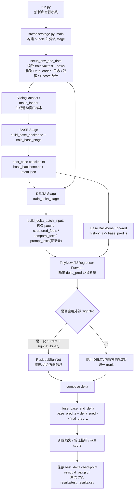

# REIN-RES-LLM 当前框架说明

本文档描述的是当前代码库里真实在运行的两阶段主框架，而不是早期的概念设计图。重点覆盖：

- 从命令行到训练/测试落盘的主流程
- 每个关键节点的输入与输出
- 关键组件的职责与相互关系
- 当前主路径、兼容路径、遗留路径的边界

## 1. 一句话总览

当前主框架是一个两阶段时序预测系统：

1. `BASE` 阶段先只看历史时间序列，输出一个基础预测 `base_pred_z`
2. `DELTA` 阶段再把历史 patch、新闻衍生特征、可选的时间对齐文本特征，与 `history_z + base_pred_z` 结合，预测一个残差修正 `delta_pred`
3. 最终预测由 `base_pred_z` 和 `delta_pred` 融合得到

当前默认配置下，主路径是：

- `residual_arch=unified`
- `delta_residual_mode=additive` 或 `relative`
- `delta_sign_mode` 只有在 `residual_arch=current` 时才真正决定是否走外部 `SignNet`

## 2. 先看一眼总流程图



## 3. 当前主路径与非主路径

### 3.1 当前真实主路径

当前真正参与训练和评估的主链路是：

- `run.py`
- `src/base/stage.py`
- `src/base/common.py`
- `src/base_backbone.py`
- `src/delta/stage.py`
- `src/delta/core.py`
- `src/model2.py`
- `src/temporal_text.py`
- `src/unified_trunk.py`
- `src/signnet/model.py`
- `src/signnet/training.py`

### 3.2 需要特别说明的“看起来存在但不是主路径”的部分

1. Prompt 文本仍然会被构建出来，但当前 DELTA 主训练路径并不把 prompt token 喂给模型。
   原因是 `build_delta_batch_inputs()` 内部调用 `build_batch_inputs(..., build_prompt_inputs=False)`。

2. 当前主框架不是“LLM 直接读 prompt 后输出预测值”的结构。
   真实主模型是 `Base Backbone + TinyNewsTSRegressor`。

3. `delta_sign_mode` 现在不是全局生效参数。
   只有 `residual_arch=current` 时，它才决定是外部 `SignNet`、内部 sign/state head，还是 `none`。
   对 `unified/simple_concat/base_only_delta` 来说，它基本只是兼容旧实验名的参数。

## 4. 顶层入口

### 4.1 `run.py`

职责：

- 解析所有训练、数据、残差、新闻、文本、缓存、优化器参数
- 调用 `src.base_delta_decoouple_trainer.main`，实际落到 `src/base/stage.py::main`

关键输入：

- 命令行参数 `args`

关键输出：

- 无直接业务输出
- 通过 `main(args)` 驱动整个训练/测试流程

几个最关键的参数：

- `stage`: `base` / `delta` / `all`
- `history_len`, `horizon`, `stride`
- `base_backbone`
- `residual_arch`: `current` / `unified` / `simple_concat` / `base_only_delta`
- `delta_residual_mode`: `additive` / `relative`
- `delta_sign_mode`: `signnet_binary` / `internal` / `none`
- `delta_temporal_text_enable`
- `delta_text_fuse_mode`: `gated_add` / `cross_attention`

## 5. 环境与数据准备

### 5.1 `setup_env_and_data(args)` in `src/base/stage.py`

职责：

- 统一实验名
- 创建日志与产物路径
- 读取 train/val/test
- 计算全局 z-score 统计
- 构造 DataLoader
- 读取新闻表
- 生成 cache / volatility / 模板等上下文

输入：

- `args`

输出：

- `bundle: dict`

`bundle` 关键字段如下：

| 字段 | 含义 |
| --- | --- |
| `stage` | 当前运行阶段 |
| `live_logger` | 实时日志器 |
| `ckpt_dir` | 当前实验 checkpoint 目录 |
| `ans_json_path` | 测试答案 json |
| `true_pred_csv_path` | 预测/真实值 CSV |
| `val_residual_debug_csv_path` | 验证集残差调试 CSV |
| `test_residual_debug_csv_path` | 测试集残差调试 CSV |
| `device` | 训练设备 |
| `train_df/val_df/test_df` | 原始数据表 |
| `train_loader/val_loader/test_loader` | 窗口化后的 DataLoader |
| `news_df` | 新闻表 |
| `templates` | prompt 模板 |
| `patch_len` | 时间序列 patch 长度 |
| `volatility_bin*` | 波动率分桶 |
| `global_zstats` | `mu_global`, `sigma_global` |
| `news_api_adapter` | API 模式下的新闻处理适配器 |

### 5.2 全局 z-score

当前框架的基础数值空间是全局 z-space：

- `z = (x - mu_global) / sigma_global`

这里的 `mu_global` 和 `sigma_global` 来自 `train_df`。

作用：

- BASE 模型在 z-space 训练和预测
- DELTA 模型也在 z-space 预测残差
- `relative` 模式下会在 raw scale 和 z-space 之间来回转换

## 6. 样本生成与 DataLoader

### 6.1 `SlidingDataset` in `src/data_construction/data.py`

职责：

- 把原始序列表转成滑动窗口监督样本

输入：

- 原始 DataFrame
- `L = history_len`
- `H = horizon`
- `stride`
- 时间列 / 数值列 / 可选 `series_id`

单样本输出：

```python
{
    "history_value": (L,),
    "target_value": (H,),
    "history_times": list[str] length L,
    "target_times": list[str] length H,
    "target_time": str,        # target 的第一个时间点
    "series_id": str,
}
```

### 6.2 `make_loader(...)`

职责：

- 将 `SlidingDataset` 包装成 `DataLoader`

输出：

- 训练、验证、测试三个 loader

## 7. BASE 阶段

### 7.1 目标

BASE 阶段只用历史序列，不看新闻，训练一个纯时序 backbone，给 DELTA 提供：

- 一个稳定的基础预测 `base_pred_z`
- 一个可以比较的基线误差

### 7.2 `train_base_stage(args, bundle)` in `src/base/stage.py`

输入：

- `train_loader`, `val_loader`
- `global_zstats`
- `base_backbone` 配置

核心流程：

1. `history_z, targets_z = _z_batch_tensors(batch, ...)`
2. `base_train_model(history_z) -> pred_z`
3. 计算点预测损失
4. 在验证集上选择 best base checkpoint

输出：

```python
{
    "best_base_path": str,
    "device": torch.device,
    "live_logger": logger,
    "templates": templates,
    "best_base_metric": float,
    "global_zstats": {...},
}
```

### 7.3 Base Backbone 输入输出

#### `DLinearBackbone`

输入：

- `history_z`: `(B, L)`

输出：

- `base_pred_z`: `(B, H)`

功能：

- 先做 trend / seasonal 分解，再分别线性投影到未来 `H` 步

#### `MLPBackbone`

输入：

- `history_z`: `(B, L)`

输出：

- `base_pred_z`: `(B, H)`

功能：

- 一个简单的 MLP 回归器

### 7.4 BASE 阶段落盘产物

- `checkpoints/<task>/best_base_<task>/base_backbone.pt`
- `checkpoints/<task>/best_base_<task>/meta.json`

其中 `meta.json` 还会保存：

- `history_len`
- `horizon`
- `mu_global`
- `sigma_global`

## 8. DELTA 阶段总览

DELTA 阶段的目标不是重新预测整条未来序列，而是学习：

- “在 base 基础上，需要修正多少”
- “修正的方向是什么”
- “新闻什么时候真正有帮助”

它的输入由两部分组成：

1. 时序主线：`history_z`、`base_pred_z`、`ts_patches`
2. 新闻侧信息：`structured_feats`、可选 `temporal_text_*`

## 9. DELTA 输入构造

### 9.1 `_z_batch_tensors(batch, args, global_zstats)` in `src/base/common.py`

职责：

- 把 batch 里的原始历史值和目标值变成 z-space tensor

输入：

- `batch["history_value"]`
- `batch["target_value"]`
- `mu_global`, `sigma_global`

输出：

- `history_z`: `(B, L)`
- `targets_z`: `(B, H)`
- `metas`: 每个样本一份 z-score 统计字典

### 9.2 `build_batch_inputs(...)` in `src/base/common.py`

职责：

- 为新闻增强和 DELTA 分支构造多模态输入

每个样本会做的事：

1. `history` / `target` 转成 z 值
2. 历史序列切成 patch
3. 从 `news_df` 中按时间窗选新闻
4. 对选中的新闻做 utility rerank
5. 生成 refined news 文本
6. 可选提取结构化事件
7. 可选构建时间对齐的 temporal text 序列
8. 可选生成 prompt 文本

返回值是一个 16 项元组：

| 返回项 | 含义 |
| --- | --- |
| `input_ids` | prompt token ids，当前 DELTA 主路径通常不用 |
| `attn` | prompt attention mask |
| `ts_patches` | `(B, P, patch_len)` |
| `ts_patch_mask` | `(B, P)` |
| `targets_z` | `(B, H)` |
| `metas` | z-score 元信息 |
| `prompt_texts` | 只用于记录/调试 |
| `rel_labels` | 新闻相关性标签 |
| `news_counts` | 每个样本选到的新闻数 |
| `news_max_utility` | 每个样本新闻 utility 最大值 |
| `structured_events_list` | 聚合后的结构化事件 |
| `structured_doc_events_list` | 文档级结构化事件 |
| `structured_feats` | `(B, F)` 结构化特征向量 |
| `temporal_text_ids` | `(B, L, Ttok)` |
| `temporal_text_attn` | `(B, L, Ttok)` |
| `temporal_text_step_mask` | `(B, L)` |

### 9.3 `build_delta_batch_inputs(...)`

职责：

- 从 `build_batch_inputs(...)` 中裁出 DELTA 真正需要的那部分

输出字典：

```python
{
    "ts_patches": (B, P, patch_len),
    "ts_patch_mask": (B, P),
    "targets_z": (B, H),
    "prompt_texts": list[str],
    "rel_labels": (B,),
    "news_counts": (B,),
    "news_max_utility": (B,),
    "structured_events": list[dict],
    "structured_doc_events": list[list[dict]],
    "structured_feats": (B, F),
    "temporal_text_ids": (B, L, Ttok) or None,
    "temporal_text_attn": (B, L, Ttok) or None,
    "temporal_text_step_mask": (B, L) or None,
}
```

注意：

- 当前 DELTA 路径虽然会返回 `prompt_texts`，但不会把 prompt token 输入模型

## 10. DELTA 主模型：`TinyNewsTSRegressor`

### 10.1 位置

- `src/model2.py`

### 10.2 `forward(...)` 输入

```python
forward(
    ts_patches,               # (B, P, patch_dim)
    ts_patch_mask,            # (B, P)
    history_z=None,           # (B, L)
    base_pred_z=None,         # (B, H)
    targets=None,
    head_mode="base"|"delta",
    rel_targets=None,
    rel_lambda=0.0,
    structured_feats=None,    # (B, F)
    temporal_text_ids=None,   # (B, L, Ttok)
    temporal_text_attn=None,  # (B, L, Ttok)
    temporal_text_step_mask=None, # (B, L)
)
```

### 10.3 `head_mode="base"`

输入：

- 只使用 `ts_patches` / `ts_patch_mask`

输出：

- `pred`: `(B, H)`
- `rel_logits`: `(B,)` 或 `(B, 1)`

用途：

- 当前主框架里基本不用这个分支做最终训练主线，真正的 base 训练走的是独立 `Base Backbone`

### 10.4 `head_mode="delta"` 主分支

这是当前最重要的分支。其内部可拆成 6 个节点。

#### 节点 A：Patch 编码

输入：

- `ts_patches`: `(B, P, patch_dim)`
- `ts_patch_mask`: `(B, P)`

处理：

- `patch_proj`
- `patch_gate`
- 可选 prototype routing
- `_pool_ts`

输出：

- `ts_feat`: `(B, P, hidden)`
- `pooled`: `(B, hidden)`

#### 节点 B：时间对齐文本塔 `TemporalTextTower`

只在 `delta_temporal_text_enable=1` 时启用。

输入：

- `temporal_text_ids`: `(B, L, Ttok)`
- `temporal_text_attn`: `(B, L, Ttok)`
- `temporal_text_step_mask`: `(B, L)`
- `target_patch_count=P`

输出包：

```python
{
    "step_feat": (B, L, step_dim),
    "step_mask": (B, L),
    "patch_context": (B, P, hidden),
    "patch_mask": (B, P),
    "text_summary": (B, hidden),
    "text_strength": (B, 1),
}
```

功能：

1. 每个历史时间步的新闻文本先编码成 step 特征
2. 再按 patch 对齐成 patch-level 文本上下文
3. 再聚合成一个全局 `text_summary`

#### 节点 C：文本与时序融合

两种模式：

- `gated_add`
- `cross_attention`

输入：

- `ts_feat`: `(B, P, hidden)`
- `patch_context`: `(B, P, hidden)`

输出：

- 融合后的 `ts_feat`: `(B, P, hidden)`

作用：

- 让每个时间 patch 感知其附近时间范围内的新闻语义

#### 节点 D：结构化新闻特征包

输入：

- `structured_feats`: `(B, F)`

输出包：

```python
{
    "feats": (B, F),
    "weight": (B, 1),
    "summary": (B, hidden),
}
```

作用：

- 将结构化事件向量压成一个 `structured_summary`
- 同时给出该结构化信息的可信权重 `structured_weight`

#### 节点 E：新闻上下文聚合

输入：

- `pooled` 时序摘要
- `structured_summary`
- `text_summary`
- `text_strength`

输出：

- `fused_news_context`: `(B, hidden)`
- `news_strength`: `(B, 1)`
- `residual_context`: `(B, hidden)`

其中：

- `fused_news_context` 主要融合结构化新闻摘要
- `residual_context` 是 DELTA 残差头真正消费的主上下文

#### 节点 F：残差头

这一步由 `residual_arch` 决定。

## 11. 四种 `residual_arch`

### 11.1 `simple_concat`

输入：

- `pooled`: `(B, hidden)`
- `text_summary`: `(B, hidden)`

处理：

- `concat([pooled, text_summary]) -> simple_delta_head`

输出：

- `pred`: `(B, H)`，直接作为 signed residual

特点：

- 最简单的文本+时序拼接基线

### 11.2 `base_only_delta`

输入：

- `pooled`: `(B, hidden)`

处理：

- `simple_delta_head(pooled)`

输出：

- `pred`: `(B, H)`，直接作为 signed residual

特点：

- 完全不使用新闻语义，只做 DELTA residual 头基线

### 11.3 `unified`

输入：

- `residual_context`: `(B, hidden)`
- `history_z`: `(B, L)`
- `base_pred_z`: `(B, H)`
- `text_summary`: `(B, hidden)`
- `text_strength`: `(B, 1)`

内部组件：

- `UnifiedResidualTrunk`

输出：

```python
{
    "direction_logits": (B, H),
    "direction_score": (B, H),   # tanh 后方向强度
    "magnitude_raw": (B, H),
    "magnitude": (B, H),         # softplus 后幅度
    "confidence_logits": (B, H),
    "confidence": (B, H),        # sigmoid 后置信度
}
```

最终残差：

```python
pred = confidence * direction_score * magnitude
```

特点：

- 方向、幅度、置信度统一建模
- 当前默认也是推荐主路径

### 11.4 `current`

这是旧残差结构保留下来的兼容路径。

它的行为还会受 `delta_sign_mode` 影响。

#### `delta_sign_mode=none`

输出：

- `direct_residual_head(residual_context) -> pred`

即直接回归 signed residual。

#### `delta_residual_mode=relative` 且 `delta_sign_mode=internal`

输出：

- `magnitude`
- `state_logits`: `(B, H, 3)`
- `state_score`: `(B, H)`

其中 3 类状态是：

- shrink
- neutral
- amplify

#### `delta_residual_mode=additive`

输出：

- `sign_logits`: `(B, H)`
- `sign_soft = tanh(sign_logits / tau)`
- `magnitude`
- `pred = sign_soft * magnitude`

## 12. `UnifiedResidualTrunk` 说明

位置：

- `src/unified_trunk.py`

输入：

- `residual_context`: `(B, hidden)`
- `history_z`: `(B, L)`，不足会补零，超长会截断
- `base_pred_z`: `(B, H)`，不足补零，超长截断
- `text_summary`: `(B, hidden)`
- `text_strength`: `(B, 1)`

输出：

```python
{
    "hidden": (B, hidden),
    "direction_logits": (B, H),
    "direction_score": (B, H),
    "magnitude_raw": (B, H),
    "magnitude": (B, H),
    "confidence_logits": (B, H),
    "confidence": (B, H),
}
```

功能关系：

- `history_proj` 编码历史窗口
- `base_proj` 编码 base 预测轨迹
- `text_proj` 编码文本摘要和其强度
- `input_fuse` 把上述信息和 `residual_context` 合到一起
- `trunk` 做共享残差推理
- 三个 head 分别预测方向、幅度、置信度

## 13. 外部 `ResidualSignNet`

### 13.1 什么时候会启用

只在下面条件同时成立时启用：

- `residual_arch=current`
- `delta_sign_mode=signnet_binary`

对应判断在：

- `src/delta/core.py::_use_external_signnet`

### 13.2 输入

```python
history_z        # (B, L)
base_pred_z      # (B, H)
structured_feats # (B, F)
text_summary     # (B, hidden) or None
text_strength    # (B, 1) or None
```

### 13.3 输出

- additive 模式：`(B, H)` 二分类 sign logits
- relative 模式：`(B, H, 3)` 三分类 state logits

### 13.4 它与 DELTA 的关系

它不是最终预测器，而是“方向控制器”。

关系如下：

1. DELTA 主模型先预测 `magnitude` 或原始残差
2. 外部 `SignNet` 再提供方向信息
3. `_compose_delta_with_external_sign(...)` 把两者合成为最终 `delta_pred`

## 14. DELTA 训练中的目标构造与融合

### 14.1 `_build_delta_targets(...)`

输入：

- `targets_z`: `(B, H)`
- `base_pred`: `(B, H)`
- `mu_global`, `sigma_global`
- `args`

输出：

- `delta_target`: `(B, H)`

两种模式：

#### additive

```python
delta_target = targets_z - base_pred
```

#### relative

先转 raw scale，再除以 base 的幅度尺度：

```python
q = (target_raw - base_raw) / scale_raw
```

### 14.2 `_build_cleaned_residual_targets(...)`

作用：

- 对 additive 残差目标做 EWMA 平滑
- 可选混入结构化事件模板，减少高噪声残差标签对方向监督的干扰

输入：

- `raw_residual`: `(B, H)`
- `structured_feats`: `(B, F)` 或 `None`

输出：

- `cleaned_residual`: `(B, H)`

### 14.3 `_build_direction_target_pack(...)`

作用：

- 从真实残差构造方向监督标签

输出：

- `loss_target`
- `eval_target`

支持：

- `hard`
- `soft`
- `windowed`

### 14.4 `_fuse_base_and_delta(...)`

输入：

- `base_pred_z`: `(B, H)`
- `delta_pred`: `(B, H)`

输出：

- `final_pred_z`: `(B, H)`

两种融合方式：

#### additive

```python
final_pred_z = base_pred_z + delta_pred
```

#### relative

```python
base_raw -> pred_raw = base_raw + ratio * scale_raw -> 再转回 z
```

## 15. `train_delta_stage(...)` 主循环

位置：

- `src/delta/stage.py`

输入：

- `args`
- `bundle`
- `best_base_path`
- `best_base_metric`

核心步骤如下。

### 15.1 准备阶段

1. 加载 `best_base` checkpoint
2. 构造 `TinyNewsTSRegressor`
3. 根据参数组建优化器和 warmup
4. 预热 refined cache / structured cache
5. 如满足条件，则预训练外部 `SignNet`

### 15.2 每个 batch 的主计算图

1. `history_z = _z_batch_tensors(...)`
2. `base_pred = base_backbone(history_z)`
3. `delta_inputs = build_delta_batch_inputs(...)`
4. `raw_delta_targets = _build_delta_targets(...)`
5. `delta_targets = cleaned residual` 或 `relative target`
6. `out_delta = delta_model(..., head_mode="delta")`
7. 如果启用外部 `SignNet`，则用它重组方向
8. `pred_real_z = _fuse_base_and_delta(base_pred, delta_pred_real, ...)`
9. 计算损失并反向传播

### 15.3 损失组成

#### 所有模式都有

- `loss_final`
  含义：最终预测 `final_pred_z` 与 `targets_z` 的点预测损失

#### direct-signed 模式

direct-signed 模式包括：

- `residual_arch in {unified, simple_concat, base_only_delta}`
- 或 `delta_sign_mode=none`

额外损失：

- `loss_signed`
  含义：直接监督预测残差和真实残差

#### unified 模式额外还有

- `loss_relative_mag`
- `direction_ce`
- `confidence_consistency`

其中：

- `direction_ce` 监督方向 logits
- `confidence_consistency` 约束高置信位置不要和真实残差偏差太大

#### current + relative 模式

额外损失：

- `loss_relative_mag`
- `state_ce`，监督 3 类状态

## 16. `evaluate_metrics_residual(...)`

位置：

- `src/delta/stage.py`

职责：

- 在验证/测试时完整复现 `base + delta` 推理
- 同时收集大量诊断指标

输入：

- `base_model`
- `delta_model`
- 可选 `external_signnet`
- `data_loader`
- `news_df`
- `templates`
- `args`
- `global_zstats`

输出：

```python
(
    final_loss,
    final_mse,
    final_mae,
    base_loss,
    base_mse,
    base_mae,
)
```

副作用：

- 写 `true_pred_csv`
- 写 `val/test residual debug csv`
- 把诊断结果挂到 `args._last_residual_eval_diag`

### 16.1 评估时会额外记录的诊断量

- sign / state accuracy
- 平均残差幅度
- `delta_helped_rate`
- `skill_score`
- 按新闻密度切片的 MAE
- 按事件期切片的 MAE
- route 使用统计

## 17. 调试与结果文件

### 17.1 Checkpoint

BASE：

- `checkpoints/<task>/best_base_<task>/base_backbone.pt`
- `checkpoints/<task>/best_base_<task>/meta.json`

DELTA：

- `checkpoints/<task>/best_delta_<task>/regressor.pt`
- `checkpoints/<task>/best_delta_<task>/meta.json`
- `checkpoints/<task>/best_delta_<task>/tokenizer/`
- 可选 `external_signnet.pt`

配对文件：

- `checkpoints/<task>/residual_pair.json`

### 17.2 调试 CSV

`_open_residual_debug_csv(...)` 会创建的字段包括：

- `z_input`
- `target_z`
- `base_pred_z`
- `true_residual_z`
- `delta_branch_output`
- `pred_residual_z`
- `sign_logits`
- `sign_soft`
- `state_logits`
- `state_score`
- `magnitude`
- `magnitude_raw`
- `news_count`
- `news_max_utility`
- `base_residual_abs`
- `delta_helped`
- `direction_correct`
- `confidence_value`
- `regime_route`

这些字段非常适合做失败样本回放。

### 17.3 汇总结果

测试阶段最终会写入：

- `results/test_results.csv`

当前会记录的核心列包括：

- `MSE`, `MAE`
- `Base_MSE`, `Base_MAE`
- `Skill_Score_MSE`, `Skill_Score_MAE`
- `Delta_Helped_Rate`
- `NoNews_MAE`, `SparseNews_MAE`, `DenseNews_MAE`
- `SignNet_Acc`, `SignNet_BalancedAcc`

## 18. 关键组件之间的关系

可以把整个系统理解成下面这张依赖图。

### 18.1 数据依赖关系

- `SlidingDataset` 负责把原始序列切成监督样本
- `setup_env_and_data` 负责给全局训练环境补齐统计量、loader、news 表、缓存、路径
- `build_delta_batch_inputs` 负责把“样本窗口”升级成“DELTA 可消费的多模态 batch”

### 18.2 模型依赖关系

- `Base Backbone` 负责给出一个不带新闻的纯时序预测
- `TinyNewsTSRegressor` 负责学习新闻驱动的残差修正
- `TemporalTextTower` 是 `TinyNewsTSRegressor` 的一个可选子模块
- `UnifiedResidualTrunk` 是 `TinyNewsTSRegressor` 在 `unified` 模式下的核心残差推理器
- `ResidualSignNet` 是 `current + signnet_binary` 条件下的外部方向控制器

### 18.3 训练依赖关系

- `train_base_stage` 必须先产出 `best_base`
- `train_delta_stage` 依赖 `best_base`
- `evaluate_metrics_residual` 同时依赖 `base_model + delta_model`

## 19. 一个完整样本从上到下怎么走

下面用单个样本来描述完整链路。

1. 原始表中的一段连续历史值和未来目标值被 `SlidingDataset` 切出来
2. `history_value` 和 `target_value` 被转成 `history_z`、`targets_z`
3. `history_z` 进入 `Base Backbone`，得到 `base_pred_z`
4. 同一条历史序列被切成 `ts_patches`
5. 与该目标时间相邻的新闻被检索、筛选、重排、精炼
6. 新闻被转换成：
   - `structured_feats`
   - 可选 `temporal_text_ids/attn/step_mask`
7. 这些信息进入 `TinyNewsTSRegressor`
8. 模型根据当前 `residual_arch` 输出一个残差 `delta_pred`
9. 若启用了外部 `SignNet`，则由它重写或补充方向信息
10. `_fuse_base_and_delta` 把 `base_pred_z` 和 `delta_pred` 合成为 `final_pred_z`
11. 验证/测试时再从 z-space 还原到 raw scale，计算 `MSE/MAE/skill score`

## 20. 最容易混淆的几个点

### 20.1 prompt 不是当前主模型输入

尽管系统仍然保留 prompt 构造代码，但当前 DELTA 主训练并不依赖 prompt token。

### 20.2 `delta_sign_mode` 不是所有架构都生效

- 对 `current`：有真实作用
- 对 `unified/simple_concat/base_only_delta`：基本只是兼容旧实验命名

### 20.3 当前默认残差主干已经是 `unified`

这意味着默认残差分解逻辑更接近：

- 方向
- 幅度
- 置信度

而不是旧的“单独 SignNet + magnitude”路线。

## 21. 推荐把框架记成这三层

如果只想抓住最核心逻辑，可以把它记成三层：

### 第 1 层：基础预测层

- `Base Backbone`
- 输入 `history_z`
- 输出 `base_pred_z`

### 第 2 层：新闻理解层

- `build_delta_batch_inputs`
- `TemporalTextTower`
- `structured_feats`

作用是把新闻变成模型可以消费的数值表示。

### 第 3 层：残差决策层

- `TinyNewsTSRegressor`
- 可选 `UnifiedResidualTrunk`
- 可选 `ResidualSignNet`

作用是回答：

- 要不要改
- 往哪个方向改
- 改多少
- 这次改动有多可信

---

如果后续框架继续演化，建议优先更新以下 4 处文档内容：

1. `residual_arch` 分支行为
2. `build_delta_batch_inputs` 的返回项
3. `evaluate_metrics_residual` 的诊断字段
4. prompt 是否重新进入主训练图
