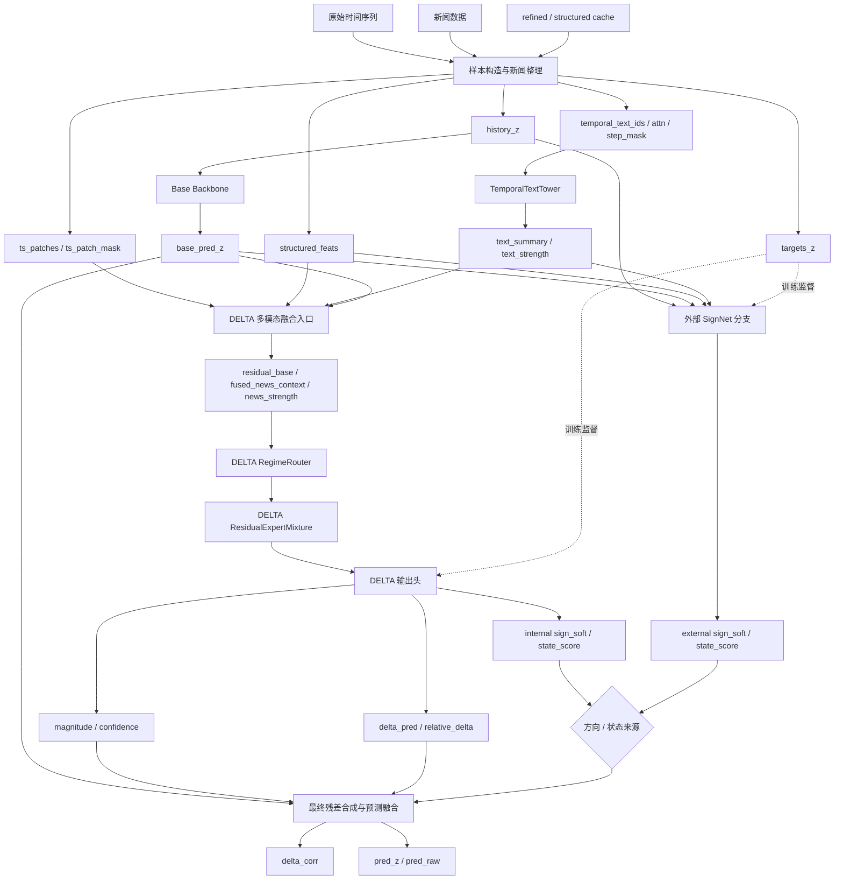

# Plan C 分析

## 1. Plan C 是什么

在当前仓库中，`Plan C` 实际对应可执行分支 `plan_c_mvp`。

它不是把整个框架替换成一个全新的单体模型，而是在现有

- `Base`
- `DELTA`
- 可选外部 `SignNet`

这条链路中，引入一层“按样本选择残差修正策略”的机制。

它的核心思想是：

- 不同样本可能处在不同 regime
- 不同 regime 需要不同的残差修正方式
- 模型不应该总是强行修正
- 在新闻弱、信号弱、场景不明确时，应该允许“少修正”甚至“不修正”

因此，Plan C 的本质是：

- 用 `RegimeRouter` 判断样本更像哪一类场景
- 用 `ResidualExpertMixture` 让不同专家分别处理不同类型的残差推理
- 用 `none` 路由显式表示 abstention，也就是抑制修正

当前代码中的路由集合为：

- `none`
- `trend`
- `event`
- `reversal`
- `sparse`

其中：

- `none` 表示倾向于不修正或弱修正
- 其余 4 个路由分别对应 4 个专家分支

## 2. Plan C 在整个框架中的位置

当前完整逻辑可以概括为：

1. `Base` 先只看历史时间序列，输出基线预测
2. `DELTA` 再结合结构化新闻和时间对齐文本，学习残差幅度与残差上下文
3. 如果开启外部 `SignNet`，则由它额外预测残差方向或残差状态
4. 最终把 `Base` 的预测与残差修正融合，得到最终预测

Plan C 主要插入在第 2 步和第 3 步之间：

- 在 `DELTA` 内部，Plan C 会影响残差上下文的构造方式
- 在外部 `SignNet` 内部，Plan C 会影响方向/状态表征的构造方式

也就是说，Plan C 不是只作用于 DELTA，也不是只作用于 SignNet，而是：

- `DELTA` 和 `SignNet` 都可以使用同一套 regime-aware 路由思想

但当前版本仍然不是一个完全共享主干的统一模型，原因是：

- `DELTA` 主要负责残差幅度和残差上下文
- 外部 `SignNet` 主要负责方向或状态
- 两者仍然是分开训练、后期组合

所以 Plan C 更准确的理解是：

- 一个“带路由的晚融合增强框架”

而不是：

- 一个彻底统一方向与幅度的共享残差主干

## 3. 整体数据流

从输入到输出，可以把 Plan C 的主链路拆成下面几个关键节点：

1. 样本构造与新闻整理
2. Base 基线预测
3. TemporalTextTower 文本编码
4. DELTA 残差底座构造
5. RegimeRouter 路由决策
6. ResidualExpertMixture 专家混合
7. DELTA 输出残差幅度
8. 外部 SignNet 输出方向或状态
9. Base 与残差融合得到最终预测

下面按节点说明输入和输出。

## 3.1 流程图

下面这张图按框架真实的 data flow 来画，重点表现：

- 输入数据如何先被整理成模型张量
- `Base`、`TemporalTextTower`、`DELTA`、外部 `SignNet` 如何并行或串联工作
- 最终残差和最终预测是在哪里汇合出来的



这张图可以概括成一句话：

- 数据先被整理成 `history_z`、`structured_feats`、`temporal_text_*`、`ts_patches` 等核心张量，然后 `Base` 产出基线预测，`TemporalTextTower` 产出文本摘要，`DELTA` 学习残差幅度与残差上下文，可选外部 `SignNet` 学习方向/状态，最后在融合层共同生成 `delta_corr` 和最终预测。

## 4. 关键节点输入与输出

### 节点 1：样本构造与新闻整理

#### 输入

- 原始时间序列数据
  表示最原始的数值观测序列，例如负荷、电价等，后续会被切成历史窗口与预测窗口。
- 新闻数据 `news_path`
  表示和时间序列配套的新闻集合，是文本信息的原始来源。
- refined/structured cache
  表示已经清洗过的新闻摘要缓存与结构化事件缓存，用来减少重复处理并稳定输入格式。
- 运行参数，如：
  - `history_len`
    表示每个样本回看多少个历史时间步。
  - `horizon`
    表示每个样本需要预测多少个未来时间步。
  - `delta_structured_enable`
    表示是否启用结构化新闻特征。
  - `delta_temporal_text_enable`
    表示是否启用时间对齐文本分支。

#### 输出

- `history_value`
  原始历史数值窗口，是每个样本真正的历史观测值。
- `target_value`
  原始未来目标窗口，是训练与评估时要预测的真实值。
- `history_z`
  对 `history_value` 做全局 z-score 标准化后的历史序列，便于模型稳定训练。
- `targets_z`
  对 `target_value` 做同样标准化后的监督目标。
- `structured_events`
  从新闻中提取出的样本级结构化事件字典，还是较为语义化的中间表示。
- `structured_doc_events`
  按新闻文档粒度保存的结构化事件结果，方便溯源和调试。
- `structured_feats`
  把结构化事件进一步映射成固定维度向量后的结果，是模型真正直接消费的结构化新闻输入。
- `news_counts`
  当前样本命中的新闻条数，用来反映新闻覆盖度。
- `temporal_text_ids`
  时间对齐文本序列对应的 token id 张量，是 TemporalTextTower 的主输入之一。
- `temporal_text_attn`
  对应 token 的 attention mask，用来区分真实 token 和 padding。
- `temporal_text_step_mask`
  表示哪些历史时间步上确实存在可用文本，哪些时间步没有文本。

#### 作用

这一层负责把“原始时间序列 + 原始新闻”转换成后续模型真正可吃的张量。

其中最关键的 4 类输出是：

- `history_z`
  历史序列的 z-score 表示
- `base_pred_z`
  由 Base 产生，不在本节点直接输出，但后续依赖这里的 `history_z`
- `structured_feats`
  固定维度的结构化新闻向量
- `temporal_text_*`
  按历史步对齐的文本序列输入

### 节点 2：Base 基线预测

#### 输入

- `history_z`
  表示标准化后的历史时间序列，是 Base 唯一核心输入，也代表“纯时间序列视角”的信息来源。

形状大致为：

- `(B, L)`

其中：

- `B` 是 batch size
- `L` 是历史窗口长度

#### 输出

- `base_pred_z`
  表示 Base 对未来 horizon 的基线预测结果，也是后续残差修正围绕的锚点。

形状大致为：

- `(B, H)`

其中：

- `H` 是预测 horizon

#### 作用

Base 的任务是学习“如果完全不看新闻，只根据历史数值，我会怎么预测”。

它给整个系统提供一个稳定锚点。后面的 DELTA 与 SignNet，本质上都在围绕这个锚点学习残差修正。

### 节点 3：TemporalTextTower 文本塔

#### 输入

- `temporal_text_ids`
  表示每个历史时间步对应文本的 token id。
- `temporal_text_attn`
  表示每个 token 是否有效，防止 padding 参与编码。
- `temporal_text_step_mask`
  表示每个历史步是否存在有效文本，帮助模型识别“有文本”和“无文本”的时间位置。

这几个张量可以理解为：

- 对每个样本的每个历史时间步，整理出对应的新闻文本片段
- 再编码为 token 序列

#### 输出

- `step_feat`
  每个历史时间步的文本编码结果，是时间步级别的文本表征。
- `patch_context`
  把步级文本特征进一步聚合到 patch 粒度后的结果，便于和时间序列 patch 对齐。
- `text_summary`
  样本级文本摘要向量，是后续 DELTA 和 SignNet 最常直接消费的文本表示。
- `text_strength`
  文本覆盖度或有效强度，用来表达“这一样本的文本证据到底强不强”。

#### 各输出含义

- `step_feat`
  每个历史步对应的文本特征
- `patch_context`
  把步级文本特征进一步按 patch 聚合后的上下文
- `text_summary`
  样本级文本摘要向量
- `text_strength`
  文本覆盖度/有效强度，数值范围约为 `[0,1]`

#### 作用

Plan C 并不直接把原始 token 序列送入路由器，而是先把文本压缩成：

- 一个摘要向量 `text_summary`
- 一个强度信号 `text_strength`

后续 DELTA 和 SignNet 都会使用这两个结果。

### 节点 4：DELTA 残差底座构造

#### 输入

- `ts_patches`
  把历史时间序列切成 patch 后得到的 patch 特征，是 DELTA 理解时间模式的主要输入。
- `ts_patch_mask`
  表示哪些 patch 是有效的，哪些 patch 只是 padding。
- `structured_feats`
  固定维度的结构化新闻向量，携带事件类型、强度等非自由文本信息。
- `text_summary`
  TemporalTextTower 输出的样本级文本摘要，用来补充自由文本语义。
- `text_strength`
  文本有效强度，用来告诉 DELTA 当前样本该不该重视文本。

#### 中间输出

- `pooled_ts`
  时间序列 patch 的全局聚合表示，是数值侧的压缩摘要。
- `structured_context`
  结构化新闻映射后的上下文表示，是结构化侧的压缩摘要。
- `fused_news_context`
  结构化新闻与文本摘要融合后的新闻上下文。
- `news_strength`
  综合结构化新闻和文本强度之后得到的新闻强弱信号。
- `residual_base`
  路由前的基础残差语义底座，是后续 Plan C 决策的核心上下文。

#### 各中间量含义

- `pooled_ts`
  时间序列 patch 特征的全局聚合表示
- `structured_context`
  结构化新闻向量映射后的摘要表示
- `fused_news_context`
  结构化新闻上下文融合后的新闻表示
- `news_strength`
  综合结构化新闻强度和文本强度后的新闻强弱信号
- `residual_base`
  进入 Plan C 路由前的基础残差上下文

#### 作用

这一步可以理解为：

- 先把“时间序列信息”
- “结构化新闻信息”
- “文本摘要信息”

融合成一个统一的残差语义底座 `residual_base`。

在 `summary_gated` 旧路径中，文本会做 patch 级门控融合。
但在 `plan_c_mvp` 中，文本更多是通过 summary/strength 参与后续路由与残差推理。

### 节点 5：RegimeRouter 路由器

#### 输入

路由器一共吃两类输入：

1. `context`
2. `scalars`

在 DELTA 中：

- `context = residual_base`
  表示 DELTA 当前样本的基础残差上下文。

在 SignNet 中：

- `context = fused`
  表示 SignNet 把历史、基线预测、新闻与文本融合后的方向/状态上下文。

#### 路由器标量输入 `scalars`

在 DELTA 中，6 维标量大致为：

- `ts_vol`
  历史序列波动度，用来刻画当前样本是否处于高波动场景。
- `patch_density`
  patch 有效密度，用来反映时间序列输入是否稠密。
- `txt_strength`
  文本强度，用来反映自由文本证据的有效性。
- `struct_strength`
  结构化新闻强度，用来反映结构化事件信号的强弱。
- `news_strength`
  综合新闻强度，用来衡量总体新闻证据是否足够强。
- `text_norm`
  文本摘要向量的范数，可看作文本表征幅度的一个辅助指标。

在 SignNet 中，6 维标量大致为：

- `hist_vol`
  历史序列波动度，反映方向/状态预测时的时序不确定性。
- `base_std`
  Base 预测的标准差，用来反映未来预测分布的离散程度。
- `base_span`
  Base 预测的跨度，用来反映未来窗口内的振幅范围。
- `txt_strength`
  文本强度，表示自由文本对方向/状态判断的支持力度。
- `struct_strength`
  结构化新闻强度，表示结构化事件证据的强弱。
- `news_strength`
  综合新闻强度，表示总体新闻证据水平。

#### 输出

- `scalar_hidden`
  标量特征投影后的隐藏表示，是路由器内部形成的辅助上下文。
- `route_logits`
  对各个 regime 的未归一化打分。
- `route_probs`
  各个 regime 的 soft 路由概率。
- `abstain_prob`
  对 `none` 路由的概率，也就是“少修正/不修正”的倾向。
- `expert_probs`
  对非 `none` 专家的概率分布，用于后续专家混合。

#### 各输出含义

- `route_logits`
  每条样本对各个 regime 的未归一化打分
- `route_probs`
  各路由的 softmax 概率
- `abstain_prob`
  对应 `none` 路由的概率
- `expert_probs`
  对应 `trend/event/reversal/sparse` 四个专家的概率
- `scalar_hidden`
  标量特征投影后的隐藏表示，后面还能继续用于融合

#### 作用

这是 Plan C 最核心的一步：

- 不再假设所有样本都应由同一套残差逻辑处理
- 而是先判断当前样本更像哪一类场景

如果 `abstain_prob` 高，说明模型倾向认为：

- 当前样本不适合做强修正
- 或者当前新闻证据不够强

### 节点 6：ResidualExpertMixture 专家混合

#### 输入

- 4 个 expert 输入向量
  表示同一个样本在不同 residual regime 假设下形成的候选残差上下文。
- `expert_probs`
  表示路由器给这 4 个专家分配的权重。

在 DELTA 中，4 个 expert 输入大致可以理解为：

- `trend`：`residual_base + pooled_ts`
- `event`：`residual_base + fused_news_context + text_context`
- `reversal`：`residual_base + fused_news_context - pooled_ts`
- `sparse`：`residual_base + sparse_scale * pooled_ts`

其中：

- `text_context = text_summary * text_strength`
- `sparse_scale = 1 - news_strength`

#### 输出

- `residual_context`
  经专家混合后得到的最终残差上下文，是 DELTA 后续输出头的直接输入。
- `expert_outputs`
  各专家各自的输出结果，主要用于分析专家是否分工有效。

#### 各输出含义

- `residual_context`
  经专家混合后的最终残差上下文
- `expert_outputs`
  每个专家各自的输出，主要用于调试和诊断

#### 作用

这一层做的事是：

1. 每个专家各自给出自己的残差解释结果
2. 用路由器给出的 `expert_probs` 做加权融合
3. 得到最终的 `residual_context`

因此，Plan C 的“按样本选择策略”并不是硬切换，而是：

- 软路由
- 软混合

### 节点 7：DELTA 输出头

#### 输入

- `residual_context`
  Plan C 路由与专家混合之后得到的最终残差语义表示。
- 可选的 `route_summary`
  路由器额外生成的摘要特征，用来继续调节残差幅度与置信度。
- `text_summary`
  样本级文本摘要，用来补充自由文本信息。
- `text_strength`
  文本有效强度，用来调节文本在输出头中的实际影响。

#### 输出

主要输出包括：

- `magnitude_raw`
  残差幅度头的原始未约束输出。
- `magnitude`
  经过非负化或约束后的残差幅度，是最终修正强弱的核心量。
- `confidence_logits`
  残差置信度头的原始输出。
- `confidence`
  残差修正置信度，用来控制修正是否保守。
- `sign_logits / sign_soft`
  在 `additive` 模式下的方向预测结果，前者是 logits，后者是软符号值。
- `state_logits / state_score`
  在 `relative` 模式下的状态预测结果，前者是三分类 logits，后者是放大/缩小倾向分数。
- `pred`
  DELTA 内部合成后的预测结果或中间预测结果，具体依赖当前模式。

#### 在不同模式下的核心输出

如果是 `additive` 模式：

- DELTA 内部可输出 `sign_logits`
- 再经 `tanh` 得到 `sign_soft`
- 组合出：
  `delta = sign_soft * magnitude`

如果是 `relative` 模式：

- DELTA 输出 `state_logits`
- softmax 后得到 `state_probs`
- 再算：
  `state_score = P(amplify) - P(shrink)`
- 若走内部符号模式，则：
  `q_hat = |q_hat| * state_score`

#### Plan C 对 DELTA 输出的额外影响

Plan C 这里有两个特别重要的点：

1. `route_summary` 可以继续加到幅度头里
2. `abstain_prob` 会压低 `confidence`

也就是说：

- 当路由器更偏向 `none` 时
- DELTA 的残差幅度会被进一步抑制

这是 Plan C 显式“保守修正”的来源。

### 节点 8：外部 SignNet 的 Plan C 分支

#### 输入

- `history_z`
  标准化后的历史时间序列，提供方向/状态判断所需的时序背景。
- `base_pred_z`
  Base 给出的基线预测，是 SignNet 判断“该往哪边修”的参照物。
- `structured_feats`
  结构化新闻向量，提供事件型先验。
- `text_summary`
  文本摘要向量，提供自由文本语义信息。
- `text_strength`
  文本有效强度，控制文本特征在 SignNet 中的可信度。

#### 输出

如果是 `additive` 模式：

- `sign_logits`
  外部 SignNet 给出的方向 logits。
- `sign_soft`
  经过温度或非线性处理后的软方向值。

如果是 `relative` 模式：

- `state_logits`
  外部 SignNet 给出的残差状态 logits。
- `state_score`
  从状态概率映射出的连续状态分数，用于调节相对修正比例。

#### 作用

外部 SignNet 的任务不是预测最终数值，而是预测：

- 残差方向
  或
- 残差状态

在 Plan C 下，SignNet 内部也会走：

- `RegimeRouter`
- `ResidualExpertMixture`

所以它也会做“按样本 regime 决定如何推理方向/状态”的处理。

但需要强调的是：

- SignNet 与 DELTA 当前仍是两个模型
- 它们共享的是设计语言，不是完全共享参数主干

### 节点 9：最终残差合成与预测融合

#### 输入

- `base_pred_z`
  Base 预测结果，是最终融合的锚点。
- `magnitude`
  DELTA 预测的残差幅度，决定“修正有多大”。
- `sign_soft` 或 `state_score`
  方向或状态控制量，决定“修正往哪边、以什么相对方式发生”。
- `delta_pred`
  DELTA 内部已经形成的残差预测中间量，在部分实现路径中参与最终融合。

#### 输出

- `delta_corr`
  最终生效的残差修正项。
- `pred_z`
  在 z-score 空间中的最终预测。
- 对应 raw 空间下的最终预测
  把 z-space 结果还原回原始量纲后的预测值，也是实际评估时更关心的输出。

#### additive 模式

在 `additive` 模式下，核心逻辑是：

```text
delta = sign_soft * magnitude
final_pred_z = base_pred_z + delta
```

#### relative 模式

在 `relative` 模式下，核心逻辑是：

```text
q_hat = |q_hat| * state_score
final_pred_raw = base_pred_raw + q_hat * scale_raw
```

其中：

```text
scale_raw = max(abs(base_pred_raw), floor_or_eps)
```

所以 relative 模式不是直接加一个绝对残差，而是：

- 先预测相对修正比例
- 再按 base 的量级恢复到 raw 空间

## 5. Plan C 的重点总结

如果把 Plan C 浓缩成一句话，可以写成：

- 它让模型先判断“当前样本属于哪种残差场景”，再决定“应该如何修正、修正多强、要不要干脆少修正”

它最关键的增强点有 3 个：

1. **按 regime 分流**
   不同样本不再共享完全同一套残差逻辑。

2. **显式 abstention**
   `none` 路由会压低修正置信度，使模型在弱证据场景下更保守。

3. **同时作用于 DELTA 与 SignNet**
   幅度建模和方向/状态建模都能拥有 regime-aware 的推理能力。

## 6. Plan C 的优势

- 更适合异质性强的数据集
- 更适合新闻稀疏和新闻密集混杂的场景
- 比“所有样本一把梭”更容易表达不同类型的残差来源
- 能显式学习“什么时候不该过度修正”

## 7. Plan C 的局限

当前实现仍有几个边界需要明确：

1. `DELTA` 与外部 `SignNet` 仍然是分开的
   方向和幅度依然主要是后期组合，不是完全统一建模。

2. 文本仍然先被压缩成 summary
   还不是 token-level 的细粒度路由。

3. 路由器和专家可能出现训练不稳定
   比如：
   - 路由塌缩到单一路径
   - 某些专家长期不被使用
   - `abstain` 比例过高或过低

所以 Plan C 当前更适合被理解为：

- 一个面向鲁棒性的 regime-aware MVP

而不是：

- 一个已经彻底解决方向-幅度耦合问题的最终形态

## 8. 最适合怎么用一句话介绍给别人

如果你后面要给别人解释，可以直接用下面这句话：

> Plan C 是在 Base + DELTA + SignNet 框架上，加了一层按样本选择残差修正策略的 regime router 和 expert mixture，使模型能根据趋势、事件、反转、稀疏新闻等不同场景，决定应该如何修正，以及是否应该保守修正。
