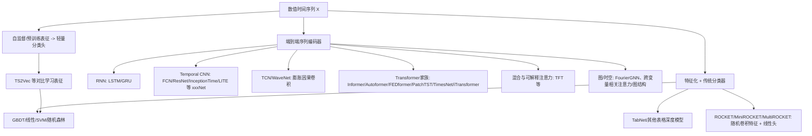

# 数值时序的正负二元分类模型综述与实战配方（截至 2026-03）

## 执行摘要

数值型时间序列做“正/负（二元）”预测，本质上是**时序二元分类**：给定长度为 *L* 的历史窗口（可多变量），输出下一步/下一段的方向标签（例如收益率>0 为正，否则为负），或输出概率再用阈值决策。这个问题在金融“涨/跌”、运营“流失/不流失”、工业“故障/正常”、风控“违约/不违约”等场景都存在，但“精准”通常很难保证：在高噪声、弱信号场景（尤其高频/短周期金融）里，即便近年来的强模型，指标也常停留在**中等偏低**区间，且对数据漂移非常敏感（下面给出近年论文的实测快照）。citeturn12view0turn10view0turn20view0

在架构层面，当前主流路线可以归为三类：  
第一类是“**特征化 + 传统分类器**”（GBDT/线性/TabNet 等），靠稳健特征工程与严格的时序验证赢；第二类是“**强基线的时序分类器**”（尤其 ROCKET/MiniROCKET/MultiROCKET、ResNet/FCN/InceptionTime 这类 *xxxNet*），对多行业时序分类非常强，数据量不大也能跑；第三类是“**Transformer/分解/补丁化/图模型/混合注意力**”等更重的端到端模型（Informer/Autoformer/FEDformer/PatchTST/TimesNet/iTransformer/TFT、FourierGNN、行业专用的 HRformer/LiT/TLOB 等），在长序列、多变量、结构化相关（图/多资产/多传感器）里更有潜力，但更吃数据与工程。citeturn18view0turn17view0turn15search0turn15search1turn15search2turn2search16turn1search17turn19search3

如果你的目标是“**高精度（Precision）**”而不是“高准确率（Accuracy）”，关键往往不在换更大模型，而在：**标签定义去噪（如设无变化带/三分类再折叠）、类不平衡处理、概率校准与阈值策略、滚动/步进式验证规程**。这类“训练与评估协议”对最终表现的影响，经常大于模型换代本身。citeturn12view0turn7search1turn7search3

## 任务定义与模型谱系

你问的“输入为数值，做正负二元分类”，一般可写成：给定多变量数值序列 \(X_{t-L+1:t}\in\mathbb{R}^{L\times d}\)，预测标签 \(y_t\in\{0,1\}\)。标签最常见的定义是“未来收益/差分的符号”，也可以是“未来 *F* 天/秒平均变化是否为正”。在金融趋势预测类论文中，二元标签常明确写为“未来收盘价是否上涨/不涨”，并把“涨”定义为 1，“跌或不变”定义为 0。citeturn10view0

需要特别直说的一点：**“时序预测（forecasting）模型 ≠ 最优的方向分类模型”**。大量 Transformer 系列工作主要优化的是 MSE/MAE 等回归误差；方向分类（sign prediction）关心的是决策边界附近的排序与概率质量。把预测值再取符号当然能用，但不一定是最优路径；很多时候直接做**分类头 + 分类损失**更贴合目标。citeturn15search0turn15search1turn15search2turn19search0

下面给出一个“模型谱系”视图（把你点名的 *Net* 变体也放进去）：



该分类法与近年综述/基准工作的“模块化视角 + 多任务评测”的组织方式一致：时序分析任务跨预测/分类/异常检测等共享骨干模块，最终差异往往由头部任务与数据协议决定。citeturn17view0turn18view0turn9search21turn4search7

## 代表模型家族深拆

### 特征工程 + 传统学习器（classical ML 与 tabular 深度）

这条路线把时间序列先**窗口化**，再将每个窗口变成一组统计/频域/形态特征（均值、方差、分位数、移动均线差、斜率、傅里叶能量、峰度偏度、最大回撤、滞后差分等），最后喂给分类器（Logistic/Linear、SVM、Random Forest、GBDT、或 TabNet）。在高噪声方向预测里，这条路线的优势是“**可控、稳健、易做校准与阈值策略**”，并且训练/推理延迟很低。citeturn12view0turn5search2turn5search1turn5search3turn5search8turn7search1

代表模型与要点如下（围绕“数值输入怎么吃进去”）：

- **XGBoost / GBDT**：核心是梯度提升树及其工程化实现，擅长处理非线性与特征交互。数值输入通常无需 embedding，但对尺度变化与泄漏很敏感（必须只用训练集拟合标准化/特征生成参数）。citeturn5search2turn5search10  
- **LightGBM**：基于直方/叶子生长等优化的 GBDT 框架，适合大规模训练与低延迟推理。citeturn5search1turn5search5  
- **CatBoost**：强调对类别特征的无偏处理，但在纯数值特征场景也常作为强 GBDT 基线存在。citeturn5search3turn5search7turn5search15  
- **TabNet**：用“序列式注意力”做特征选择与可解释学习，输入是 tabular 数值向量；用于时序时通常依赖你把窗口变成 tabular 特征（或把每个时间步当特征并加 mask）。citeturn5search0turn5search8turn5search12  

在方向二分类里，传统模型常见弱点是：**太依赖你是否定义了“信号更强”的标签与特征**。比如高频涨跌如果把“几乎没动”的样本硬塞进二分类，会把边界附近变成纯噪声，模型再强也会被拉低。LiT 的实验明确采用阈值把涨/平/跌分三类，并可排除“无变化”时间点，本质上就是在做“标签去噪/可预测性放大”。citeturn12view0turn21view2

### ROCKET / MiniROCKET / MultiROCKET：极强的数值时序分类“工业级基线”

这条线非常符合你说的“xxxNet 但又要在数值输入下很准”：其思想是把序列直接变成大量卷积统计特征，最后用线性分类器。它往往在各种时序分类基准上非常强，而且训练速度极快，特别适合做方向二分类的“第一性强基线”。citeturn6search1turn0search1turn14view0turn6search2

- **ROCKET**：用大量“随机卷积核”（随机长度、权重、偏置、膨胀、padding）对原始数值序列做卷积，再用汇聚统计（论文中强调 PPV 等）形成特征，最后训练线性分类器。citeturn6search5turn6search9turn6search17  
- **MiniROCKET**：对 ROCKET 做近似确定化与极致加速，被公开标注为 KDD 2021 版本并提供复现代码。citeturn0search1turn0search16  
- **MultiROCKET**：在 MiniROCKET 上加入**多种 pooling**与**变换**来提升特征多样性：对原序列做一阶差分，并在原序列与差分序列上卷积；同时除了 PPV 还加入额外 pooling；默认特征维度可到约 50k，并仍然用线性头完成分类。citeturn14view0turn13view0turn0search15  

数值输入处理上，ROCKET 系列通常假设你输入的是等间隔数值序列，可做 z-score 等标准化；MultiROCKET 的“一阶差分”对非平稳与趋势变化尤其相关，这与“正负”任务高度契合（本质上符号就是差分/收益率的符号）。citeturn14view0

优缺点直说：  
强项是**快、强、对小数据友好、对部署友好**；短板是对“缺失、非等间隔、多模态（含文本）”需要额外工程，且不是端到端的概率建模（概率校准与阈值策略仍得你自己做）。citeturn6search1turn7search1turn7search3

### Temporal CNN（ResNet/FCN/InceptionTime 等 xxxNet）与轻量化新变体

时序 CNN 的核心是 1D 卷积在时间维提取局部形态特征，再通过池化/残差/多尺度模块聚合。它对数值输入最“原生”：张量直接进卷积层即可。经典强基线工作表明，纯端到端的 FCN 与 ResNet 结构在时序分类上就能很强。citeturn4search6turn6search0

- **FCN / ResNet（1D）**：作为“从零开始做时序分类”的强基线，强调端到端训练并探索深残差结构。citeturn4search6  
- **InceptionTime**：把 Inception 式多尺度卷积分支引入时序分类，并做集成（ensemble）以提升总体精度，是典型的 *xxxNet* 代表。citeturn6search0turn6search16turn1search3  
- **LITE（Light Inception with boosTing tEchniques）**：2024 的工作强调把若干“在 SOTA 时序网络中被证明有效”的技巧组合到更小模型里，以在效率与精度间取得更好平衡。citeturn9search18  

在“正/负”二元方向预测里，Temporal CNN 的优势是**低延迟、易并行、对噪声有一定鲁棒性**；弱点是如果你的标签依赖长距离信息（很长的 lookback），模型需要足够大的感受野（dilation/更深层/多尺度）才吃得下，否则容易退化为“只看最近几步的局部波动”。citeturn4search4turn9search18

### TCN / WaveNet：用膨胀因果卷积把感受野拉长

- **TCN（Temporal Convolutional Network）**：典型做法是因果卷积 + 膨胀卷积 + 残差块，通过堆叠扩大感受野；其序列建模评估工作指出 TCN 在多种序列任务上可优于经典 RNN（LSTM/GRU），同时具备卷积并行优势。citeturn4search4turn4search0  
- **WaveNet 风格**：同样依赖因果 + 膨胀卷积（最早用于音频生成），在时序任务里常被当成“强 TCN 模板”。citeturn4search1  

数值输入处理通常只需要标准化；不需要 token embedding。对“短期方向”这种局部统计很强的任务，TCN 往往是比 RNN 更划算的端到端选择。HRformer 的金融趋势预测对比表里也包含 TCN 基线，说明它在实务领域依然是常用参照。citeturn11view3turn4search4

### RNN（LSTM/GRU）：仍然能打，但越来越像“次优默认项”

RNN 的价值在于显式的时间递归状态，对可变长度、在线更新友好；但训练难并行，长序列梯度问题与工程吞吐也更麻烦。TCN 评估工作明确把 TCN 和 LSTM/GRU 作为可替代方案进行比较。citeturn4search4turn4search0

在近年的高频市场 movement 预测对比里，LSTM 作为深度基线通常能比传统 ML 稍强，但整体提升有限（尤其在最短预测窗）。LiT 的实验表清晰展示：在 300–500ms 预测窗，LSTM 的 Accuracy 约 57.31%，而更强结构能进一步提高到约 59% 左右。citeturn12view0

### Transformer 系：Informer/Autoformer/FEDformer/PatchTST/TimesNet/iTransformer/TFT 与 MLP-Mixer 线

Transformer 在时序里主要解决两个点：**长依赖**与**多变量交互**。但它也更吃数据、更容易过拟合，且在方向预测里“回归误差小≠方向对”。因此很多新工作在结构上做了“稀疏注意力、分解、频域、补丁化、反转 token、混合 MLP”等改造。citeturn15search0turn15search1turn15search7turn15search2turn2search16turn19search0

代表模型（均可在最后接分类头做二元输出）：

- **Informer**：提出 ProbSparse 自注意力把复杂度降到 \(O(L\log L)\)，并通过 attention distilling 和生成式 decoder 提升长序列推理效率，面向 LSTF（长序列预测）设计。citeturn15search0turn15search4turn1search0  
- **Autoformer**：把趋势-季节分解作为网络内模块，并用 Auto-Correlation 机制在子序列层面做依赖发现与聚合，强调在长预测上更有效率与精度。citeturn15search1turn1search1turn1search5  
- **FEDformer**：结合分解与傅里叶稀疏性，强调线性复杂度，并报告在多基准上相对误差下降。citeturn15search7turn15search11turn15search3  
- **PatchTST**：把序列切成“补丁（patch）”作为 token，并采用“通道独立（channel-independence）”共享 embedding 与 Transformer 权重，兼顾多变量与长 lookback。citeturn15search2turn0search2  
- **TimesNet**：定位为通用时序分析模型，强调通过 2D 变分建模支持多任务（预测/分类/异常等）。citeturn0search14turn0search3  
- **iTransformer**：把“变量（series）当 token”来建模多变量相关，强调对高维多变量预测更有效，是近年很有代表性的“结构反转”路线。citeturn2search16turn2search12turn2search0  
- **TFT（Temporal Fusion Transformer）**：强调把局部时序处理（含循环层）与可解释注意力结合，用于多步/多特征预测并提供解释性输出；改成分类头后常用于“未来是否上升/是否触发事件”的概率预测。citeturn1search17turn1search6  
- **MLP/MLP-Mixer 变体（DLinear/LTSF-Linear、TSMixer、以及金融里的 StockMixer、LOB 里的 MLPLOB）**：近年一个重要趋势是“**简单线性/MLP 在时序里并不弱**”。LTSF-Linear 直接质疑 Transformer 在长预测任务中的有效性并给出线性强基线；TSMixer 把 time-mixing 与 feature-mixing 的 MLP 叠加；StockMixer 是面向股票预测的 MLP 架构；TLOB 工作甚至显示把简单 MLP 架构适配到 LOB（MLPLOB）可超越某些复杂 SoTA，并提出 TLOB 作为双注意力 Transformer。citeturn19search0turn2search22turn2search19turn19search1turn20view0turn20view0  

数值输入“怎么进 Transformer/MLP-Mixer”：典型是先用线性层把每个时间步（或每个 patch）投影到 \(d_{\text{model}}\)，再加位置编码/时间特征；补丁化模型把 \((L,d)\) reshape 成 \((N_{\text{patch}}, d_{\text{patch}})\) token；iTransformer 则改变 token 轴。LiT 的 LOB Transformer 例子非常具体：对结构化矩阵做 patch 切分，线性投影后拼接可学习位置 embedding，再进 Transformer 层。citeturn12view0turn21view2turn15search2turn2search16

### 图与时空相关：FourierGNN、跨变量相关注意力、以及更“金融化”的结构

当你的“多变量”不是独立通道，而是存在明确关系（道路拓扑、传感器网络、资产相关图），**图/时空模型**会更匹配。FourierGNN 就是把多变量预测从“时空分开建模”转为“纯图视角的统一建模”，并结合傅里叶思想。citeturn19search3turn19search7turn19search15

在金融“多股票涨跌”里，结构化相关往往通过注意力/图来建模。HRformer 明确包含跨股票相关注意力模块，并把趋势预测建模为二元分类。citeturn10view0turn11view3

### 自监督/预训练表征：TS2Vec 与“先学表示、再分类”

当标注稀缺或跨域迁移重要时，“无监督/自监督表征 + 轻量分类头”很实用。TS2Vec 给出学习通用时序表征的框架并提供官方实现；后续可以在二元方向任务上用这些表征训练 Logistic/小 MLP，通常比从零训练大模型更稳。citeturn4search15turn4search7turn9search21

## 经验表现与可用基准

先把“可比基准”问题讲清楚：  
通用时序分类领域最常用的公开基准是 **UCR/UEA**（主要是多类别分类，不是涨跌），它们推动了 InceptionTime、ROCKET 系列、HIVE-COTE 2.0 等方法的系统比较。citeturn6search3turn6search2turn6search0turn6search1turn14view0  
而“涨/跌（sign）”这种任务往往**强领域依赖、标签定义多样、评估协议差异巨大**，所以很难像 UCR 那样形成“一张榜单”。因此更现实的做法是：看几个“最接近的公开方向预测”案例，理解量级与难点，再在你的数据上做严谨滚动验证。citeturn7search3turn12view0turn10view0

下面给出两类近年公开实验的“指标快照”，用来校准你对“精准”的直觉：

**多股票日频趋势二元分类（NASDAQ100 / CSI300）**  
HRformer 把趋势预测明确成二元分类任务，并报告 Accuracy/Precision/Recall/F1。其对比表显示：在 NASDAQ100 上，HRformer 的 ACC 约 54.91、F1 约 63.88；作为对照，普通 Transformer 基线 ACC 约 53.51、F1 约 61.33，DLinear 基线 ACC 约 51.40。整体结论非常直白：**方向二分类即使在“看起来很长的 48 步窗口”下，Accuracy 依然不高**（且与 F1 并不同步，提示类分布与阈值会显著影响指标）。citeturn11view3turn10view0

**高频市场 movement 分类（含涨/平/跌，多窗口）**  
LiT 在加密市场 Level-2 高频订单簿上做 movement 分类，并明确指出在最短预测窗（300–500ms）下，各指标普遍低于 60%，强调“超短期噪声与波动”导致困难；同时给出了具体数值：在 300–500ms 预测窗，LiT 的 Accuracy 约 59.03、F1 约 58.99；预测窗变长到 300–700ms 后 Accuracy 可到约 64.58；到 300–1000ms 时 Accuracy 可到约 68.34。这个结果传递的信号是：**你想要“更准”，很多时候要先改变预测窗/标签定义，把纯噪声成分降下来**。citeturn12view0turn21view2

**FI-2010 等 LOB 基准上的趋势预测**  
TLOB 工作基于 FI-2010 等数据做趋势预测，强调既可以用更复杂的双注意力 Transformer（TLOB），也可以用更简单的 MLP 架构（MLPLOB）挑战“越复杂越好”的直觉，并报告在 FI-2010 上平均提升 F1（百分点级）。它还指出在更有效率的市场（如 NASDAQ 某些股票）上更难预测，并讨论可预测性随时间下降。citeturn20view0turn3search8

结论（不粉饰）：如果你期望的是“接近 90% 的方向正确率”，在大多数真实高噪声场景基本不现实；更可行的目标是：通过校准与阈值控制，把模型变成“**只在很有把握时才报正/报负**”，以换取你关心的高 Precision，同时接受 Recall 下降。citeturn7search1turn12view0turn7search3

## 数据处理与训练细节

### 数值输入的预处理与防泄漏

1) **窗口化（sliding/rolling window）**：定义 lookback \(L\) 与预测跨度 \(F\)。金融文献里常见“用过去 T 天技术指标预测未来 F 天涨跌”的设定；HRformer 就明确以序列长度为输入并预测未来一段的涨跌概率。citeturn10view0turn11view3  

2) **标准化必须只在训练集拟合**：z-score/min-max/robust scaling 都可以，但务必避免把未来信息带进统计量。LiT 在订单簿上明确对价格与成交量**分别做 z-score**以保证数值稳定。citeturn21view2  

3) **差分/收益率化**：对方向任务通常有帮助，因为标签就是差分符号；MultiROCKET 把“一阶差分”作为核心增强之一，也侧面印证差分对判别性的重要性。citeturn14view0  

4) **缺失与不规则采样**：如果是事件驱动数据（成交/订单簿/日志），先定义事件序列与对齐方式，否则模型会学到“采样机制”而不是“信号”。LiT 明确通过构建事件序列并设阈值将 movement 分为 upward/stable/downward，并可排除 mid-price 无变化点。citeturn21view2  

### 类不平衡、损失函数与校准

方向二分类经常不平衡（例如“上涨”比例不等于 50%），这会导致 Accuracy 与 F1/Precision/Recall 的解读非常不一致（HRformer 的表里就能看到这种现象）。citeturn11view3

可用的工程组合通常是：

- **加权 BCE / 代价敏感学习**：最基础，直接按 class weight 调整损失贡献。LiT 在多分类场景里甚至直接按类频率对指标做归一化/重标权重，说明它把类频率影响当作显式问题处理。citeturn21view2turn12view0  
- **Focal Loss**：通过降低“易样本”的损失权重来聚焦难样本，经典用于极端类不平衡；方向预测若正类稀少或你追求高 precision 时可考虑。citeturn7search0turn7search4  
- **概率校准（calibration）**：深模型常“过度自信”，阈值策略会因此失效；温度缩放（temperature scaling）是经典低成本校准方法。citeturn7search1turn7search5  

评价建议别只盯 Accuracy：至少同时报告 **Precision/Recall/F1、ROC-AUC 或 PR-AUC**，并在需要概率决策时关注校准（例如用 Brier Score 或 ECE 类指标）。Brier 分数是二元概率预测的经典评分规则，在很多领域被用来衡量概率质量。citeturn7search18turn7search1

### 评估协议：滚动起点（rolling origin）优先

对于时间序列，随机打乱的 K 折几乎总是错的（信息泄漏）。更可靠的是“滚动预测起点”的时间序列交叉验证：训练窗随时间推进，测试窗在未来，最后对各折指标求平均。citeturn7search3turn7search11

高频场景还要额外重视“分布漂移”：LiT 的实验讨论了用历史月训练后对未来月直接 zero-shot 会显著退化，并展示通过预训练+微调来缓解。citeturn21view1turn12view0

## 场景化推荐与模型对照表

### 选型建议（按真实约束而不是按“时髦程度”）

- **数据量中小、希望快速得到强基线、延迟敏感**：先上 ROCKET/MiniROCKET/MultiROCKET 或 Temporal CNN（ResNet/FCN/InceptionTime/LITE）。ROCKET 系列在可扩展时序分类上被反复证明“快且准”；MultiROCKET 用一阶差分与多 pooling 增强判别力，非常适合“正负”类任务。citeturn6search1turn14view0turn6search2turn6search0turn9search18  
- **多变量很高维、变量间相关强、需要长 lookback**：优先考虑 PatchTST 或 iTransformer 这类面向多变量结构改变的 Transformer（尤其 iTransformer 强调把变量当 token 以捕捉多变量相关）。citeturn15search2turn2search16turn2search12  
- **强噪声短周期（高频 movement、短期涨跌）**：要么做标签去噪（设 stable 带/排除无变化），要么上更贴合结构的模型（如 LOB 场景的 LiT/TLOB），并接受“指标不可能太高”的现实。citeturn12view0turn21view2turn20view0  
- **需要可解释与可控决策（阈值、风险约束）**：优先表格路线（GBDT/TabNet）或 TFT 这类强调解释性的结构，并务必做概率校准。citeturn5search8turn1search17turn7search1  
- **存在明确拓扑/关系图（传感器网、路网、多资产相关）**：看 FourierGNN 等图视角模型，或在 Transformer/CNN 上加关系建模模块（例如 HRformer 的跨股票相关注意力）。citeturn19search3turn19search15turn10view0  

### 模型对照表（面向“数值时序 -> 正负二元分类”）

| 模型/家族 | 输入形态 | 更适合的序列长度 | 可解释性 | 线上延迟 | 经验表现参考（方向/近似任务） |
|---|---|---|---|---|---|
| GBDT（XGBoost/LightGBM/CatBoost） | 窗口特征化后的 tabular 数值 | 短-中（取决于特征） | 中（特征重要性） | 低 | 在高噪声方向任务中常作为稳健强基线；性能高度依赖标签与特征定义。citeturn5search2turn5search1turn12view0 |
| TabNet | tabular 数值（可做窗口展开/聚合特征） | 短-中 | 中-高（特征选择） | 中 | 适合作为“少特征、要可解释”的深度替代。citeturn5search8turn5search12 |
| ROCKET/MiniROCKET/MultiROCKET | 原始数值序列（等间隔） | 短-中 | 低-中（线性头但特征随机） | 低 | 多数据集时序分类接近/达到 SOTA 且极快；MultiROCKET 引入差分与多 pooling 增强。citeturn6search5turn0search1turn14view0 |
| FCN/ResNet（1D） | 原始数值序列 | 短-中 | 低 | 低 | “从零训练”也能强；是很多任务的卷积基线。citeturn4search6 |
| InceptionTime / LITE（xxxNet） | 原始数值序列 | 短-中 | 低 | 低-中 | 多尺度卷积/轻量技巧在时序分类常很强。citeturn6search0turn9search18 |
| TCN / WaveNet 风格 | 原始数值序列 | 中-长（靠 dilation） | 低 | 低 | TCN 评估表明可优于 RNN 且更易并行；金融趋势基线中也常见。citeturn4search4turn11view3turn4search1 |
| LSTM/GRU | 原始数值序列 | 短-中（长序列训练成本高） | 低 | 中 | 在高频 movement 对比中优于传统 ML 但提升有限。citeturn12view0turn4search4 |
| PatchTST / iTransformer / TimesNet（Transformer 新范式） | 数值序列 → patch/token/变量 token | 中-长、尤其多变量 | 低-中 | 中-高 | 更擅长长依赖与高维交互；但更吃数据与协议。citeturn15search2turn2search16turn0search14 |
| Informer / Autoformer / FEDformer（效率/分解/频域） | 数值序列 + 位置/时间编码 | 长序列预测改分类 | 低 | 中 | 主要为预测设计；可改分类头，但不保证优于更简单基线。citeturn15search0turn15search1turn15search7turn19search0 |
| TFT（混合注意力 + 解释） | 数值序列 + 协变量 | 中 | 中-高 | 中-高 | 强调解释性与多时域依赖，可改成二分类概率输出。citeturn1search17turn1search6 |
| FourierGNN（图/时空） | 多变量序列 +（显式/隐式）图关系 | 中-长，高维相关 | 低 | 中 | 对“变量间相关强”的时空任务更合适。citeturn19search3turn19search7turn19search15 |
| HRformer / LiT / TLOB（方向预测专用/高度结构化） | 金融序列/LOB 结构化张量 | 依场景 | 中（部分模块可解释） | 中-高 | 公开报告显示方向/动量预测指标常在中等区间，且短周期更难；但结构适配可带来百分点级提升。citeturn11view3turn12view0turn20view0 |

## 资源链接与落地流程

### 关键论文与官方实现链接（按你关心的“Net/xxx 变体”优先）

```text
ROCKET (paper): https://arxiv.org/abs/1910.13051
ROCKET (code): https://github.com/angus924/rocket

MiniROCKET (code): https://github.com/angus924/minirocket
MultiROCKET (paper, open access): https://link.springer.com/article/10.1007/s10618-022-00844-1
MultiROCKET (code): https://github.com/ChangWeiTan/MultiRocket

InceptionTime (paper): https://arxiv.org/abs/1909.04939
InceptionTime (code): https://github.com/hfawaz/InceptionTime

TS2Vec (code): https://github.com/zhihanyue/ts2vec

Informer (paper): https://arxiv.org/abs/2012.07436
Informer (code): https://github.com/zhouhaoyi/Informer2020

Autoformer (paper): https://arxiv.org/abs/2106.13008
Autoformer (code): https://github.com/thuml/Autoformer

FEDformer (paper): https://arxiv.org/abs/2201.12740
FEDformer (code): https://github.com/MAZiqing/FEDformer

PatchTST (paper): https://arxiv.org/abs/2211.14730
PatchTST (code): https://github.com/yuqinie98/PatchTST

TimesNet (paper): https://arxiv.org/abs/2210.02186
Time-Series-Library (models benchmark): https://github.com/thuml/Time-Series-Library

iTransformer (paper): https://openreview.net/forum?id=JePfAI8fah
iTransformer (code): https://github.com/thuml/iTransformer

TSMixer (paper): https://openreview.net/forum?id=wbpxTuXgm0

FourierGNN (paper): https://arxiv.org/abs/2311.06190
FourierGNN (code): https://github.com/aikunyi/FourierGNN

LiT (LOB Transformer, paper): https://pmc.ncbi.nlm.nih.gov/articles/PMC12555381/
TLOB / MLPLOB (paper + code link): https://arxiv.org/html/2502.15757v2

Time-series CV (rolling origin, practical guide): https://otexts.com/fpp3/tscv.html
Temperature scaling calibration (paper): https://arxiv.org/abs/1706.04599
Focal loss (paper): https://arxiv.org/abs/1708.02002
```

上述链接对应的论文/仓库均在本文引用中出现（如 ROCKET、MultiROCKET、Informer、Autoformer、FEDformer、PatchTST、iTransformer、LiT、TLOB 等）。citeturn6search5turn14view0turn15search0turn15search1turn15search7turn15search2turn2search4turn12view0turn20view0turn7search3turn7search1turn7search0

### 实战配方：从数值时序到高精度正负分类器

```mermaid
flowchart LR
S[原始数值时序] --> D1[定义预测跨度F与标签规则]
D1 --> D2[时间切分 + 滚动验证]
D2 --> P1[预处理: 对齐/缺失/去极值/标准化(仅训练拟合)]
P1 --> P2[可选: 差分/收益率化/频域特征 或 patch 化]
P2 --> M1[模型训练: 基线 -> 强模型]
M1 --> C1[概率校准(温度缩放等)]
C1 --> T1[阈值选择: 以Precision为目标]
T1 --> E[离线评估: PR-AUC/F1/校准 + 稳健性]
E --> O[上线: 监控漂移 + 周期微调]
```

落地步骤建议按“先基线、再复杂”的顺序推进（这是最省时间、也最不容易自嗨的路径）：

第一步是把标签定义做扎实。对“涨/跌”这类任务，建议明确：  
- 预测目标是 \(t+1\) 还是 \(t+F\)；  
- 是否把“小波动”视为噪声并剔除/设为 stable（先三分类再折叠成二分类也行）；  
- 是否把“未变”归为负类（HRformer 就把 0 定义为“不涨（跌或不变）”，1 定义为“涨”）。citeturn10view0turn21view2turn20view0  

第二步是严格的时间验证：用滚动起点（rolling origin）或滚动窗口交叉验证，避免随机划分。citeturn7search3turn7search11  

第三步先跑“强且快”的基线：MultiROCKET 或 InceptionTime/LITE，外加一个 GBDT（用差分、移动统计、频域等窗口特征）。这一步的目的不是追 SOTA，而是建立“这个数据到底有没有可预测性”的下限/上限感。citeturn14view0turn6search0turn9search18turn5search1turn5search2  

第四步再决定是否用 Transformer/图模型：如果你是高维多变量、强相关、长 lookback，再上 PatchTST/iTransformer/FourierGNN；如果你是结构化 LOB，就参考 LiT/TLOB 这种专用结构（注意它们也强调标签阈值与漂移）。citeturn15search2turn2search16turn19search3turn21view2turn20view0  

第五步把“高精度”落到可操作策略：用校准后的概率 \(p(y=1|x)\)，在验证集上选择阈值使 Precision 达标（同时监控 Recall 与样本覆盖率）。温度缩放是成本很低但常有效的校准方法，focal loss/类权重用于类不平衡。citeturn7search1turn7search0turn11view3  

第六步做“现实检验”：对金融方向预测尤其要接受“短周期更难”的事实。LiT 的结果明确说明在最短预测窗下所有模型都不到 60% 水平，这类信号很容易被噪声吞掉；TLOB 也强调市场效率提升会侵蚀可预测性，并讨论交易成本对有效性的影响。citeturn12view0turn20view0