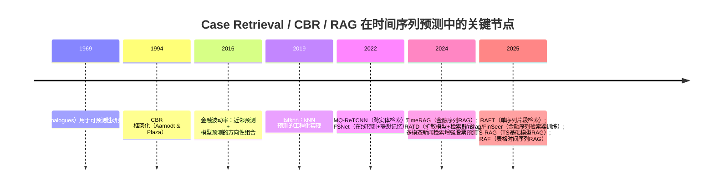

# 案例检索如何帮助时间序列预测：方法谱系、经验证据与可复现实验框架

## 执行摘要

“案例检索/实例检索”（case retrieval）在时间序列预测中并不是新概念：它可以追溯到气象学的“类比预测”（analog forecasting），即在历史轨迹中寻找与当前状态相似的“类比态”，再用其后续演化作为参考。citeturn15search5turn15search1 现代意义上的“案例推理”（CBR）把“检索—复用—修正—学习”的闭环抽象成通用范式，为“以历史相似案例辅助决策/预测”奠定了方法学框架。citeturn15search4

过去约十年，检索思想在时间序列预测里重新升温，主要原因很直接：深度模型在“长尾/罕见模式”“结构突变与分布漂移”“跨实体共享信息”“模型可解释性/可审计”方面仍存在缺口，而检索提供了一种外部记忆与局部泛化机制。典型证据包括：citeturn19view0turn6view5turn21view4turn20view0  
- 以单序列片段检索为核心的 **RAFT**（entity["organization","ICML","machine learning conference"] 2025）用“全历史范围检索 + 软注意力加权后续片段”作为显式归纳偏置，在 10 个常用基准数据集上平均胜率报告为 86%，并给出预计算与步长增大下的延迟—精度权衡。citeturn19view0turn25view0turn25view5  
- 面向零样本预测的 **TS-RAG**（entity["organization","NeurIPS","machine learning conference"] 2025）明确把检索定位为“适配非平稳与分布漂移”的机制：用预训练时间序列编码器检索相似片段，并通过可学习的检索融合模块提升零样本精度，报告在 7 个公开基准上对现有 TS 基础模型最高提升 6.84%。citeturn33view0  
- 在需求预测等“大规模多实体”场景，**MQ-ReTCNN** 用近邻/子模检索近似“跨实体注意力”，在 200 万商品规模数据上报告约 1% 的总体提升；在 1 万商品设定下，P50 与 P90 分位损失相对 MQCNN 基线分别改善 3.2% 与 2.2%（作者给出相对改进幅度）。citeturn13view1turn13view2  
- 在金融与宏观等“制度变化频繁”的场景，检索不仅用于“找相似段”，也用于“对齐不断变化的变量/表结构”：例如 **RAF（表格时间序列）**提出可学习“列元数据哈希/对齐 + 时间衰减”的检索相似度，并在 FRED-MD 与 WorldBank 上给出显著 sMAPE 改善与结构变更鲁棒性结果（个别结论强依赖论文设定，需独立复核）。citeturn21view0turn21view1turn21view4turn21view3  

结论需要说清楚：检索确实能带来可观增益，但它也极易引入信息泄露（lookahead）、工程代价高（索引、更新、缓存、延迟），且“相似≠因果相关”会导致检索误导；做不好时，检索模块会把系统变成一个昂贵且不稳定的“近邻噪声注入器”。citeturn19view0turn26view0turn20view0

## 概念界定与检索范式谱系

这里将“案例检索（case retrieval）”定义为：对给定预测查询（通常是某一时刻的观测窗口、上下文特征、或多模态描述），从“案例库/记忆库”中检索一组与查询在某种表示空间中相似或互补的历史案例，并把这些案例以“直接预测、特征增强、条件先验、融合推断或解释证据”等方式用于输出未来值/分布或用于解释输出。citeturn15search4turn19view0turn33view0

在时间序列任务中，“案例”常见三种粒度：  
- **窗口型案例**：长度为 *L* 的历史片段（含多变量），并附带其后续 *H* 步（作为“解/标签/后件”）。RAFT 就把“键片段（key patch）”与其后续“值片段（value patch）”构造成键值对库。citeturn19view0  
- **实体型案例**：一个实体（商品/门店/股票/传感器）的上下文表示或预测状态；多实体检索用于跨实体共享规律，MQ-ReTCNN把检索作为跨实体注意力的近似。citeturn13view2turn13view3  
- **文本锚定案例**：时间序列窗口与同期文本（新闻、公告、财报片段、社媒）绑定；检索可发生在文本空间、数值空间或二者联合空间。citeturn23view0turn24view2turn21view3  

为覆盖你要求的变体，给出一份面向时间序列预测的“检索范式分类”（强调“检索—使用方式”而非模型家族）：citeturn15search4turn19view0turn33view0turn6view5turn28view0turn20view0  

- **实例检索 / kNN 检索（Instance Retrieval / kNN）**：用距离/相似度在案例库中取 top-*k*，用于回归/分类或作为融合输入。金融波动率预测中“找相似局部历史并汇聚其后续”就是典型非参数近邻预测思想。citeturn20view0turn19view0  
- **历史相似案例检索（Analog / Similarity Retrieval）**：强调“形状相似”“趋势相似”“制度/环境相似”，可视为类比预测的现代实现。citeturn15search5turn19view0  
- **记忆增强检索（Memory-Augmented Retrieval）**：把案例库视为可写外部记忆；既检索也在线更新。在线预测场景中，FSNet 用联想记忆来“记住—回忆重复事件”，并与慢学习骨干网络协作。citeturn6view5turn12view0  
- **RAG（检索增强生成）迁移到时间序列（Retrieval-Augmented Generation）**：将检索到的案例转成上下文，注入大模型/基础模型推断过程。TS-RAG、TimeRAG、FinSrag 都属于这一谱系，但其“检索对象”（数值片段/表格/文本）和“融合位置”（输入上下文/中间表示/输出层）不同。citeturn33view0turn22view0turn7view0  
- **基于案例推理（CBR）**：强调“检索—复用—修正—学习”的循环与可解释性；在预测中可直接输出，也可用于解释黑箱预测（explanation-by-example）。CBR-fox/CBR-FoX 用滑窗构建案例库，检索相似案例解释预测，提供 DTW/相关性等多种距离。citeturn28view0turn14search9turn29view0  
- **面向协变量/概念漂移的检索（Retrieval for Covariate Shift / Drift）**：当数据分布随时间改变，检索可以通过“只用近期/相似制度”的案例子集来做局部适配；这一点在概念漂移综述中被系统化讨论，而 TS-RAG、FSNet、RAF 等把它落到“检索 + 衰减/记忆更新/动态对齐”机制里。citeturn32search0turn33view0turn6view5turn21view1  

## 文献综述与代表性方法

从 2016–2025 的脉络看，时间序列预测里的“案例检索”大致经历三次聚焦：  
- **非参数近邻与组合预测（2016 左右）**：以金融波动率等为代表，近邻方法作为“抗设定错误”的对照或与模型预测组合，在不同市场状态（平稳/动荡）下体现经济价值与统计指标的错位。citeturn20view0  
- **深度学习时代的“显式记忆/检索”回归（2022 左右）**：一边是大规模多实体需求预测里用检索近似跨实体注意力（MQ-ReTCNN），另一边是在线学习/分布漂移里用可写记忆帮助快速适配与“重复事件”回忆（FSNet）。citeturn13view2turn6view5turn12view0  
- **TS 基础模型/LLM 时代的 RAG 化（2024–2025）**：检索被包装成“给大模型补外部上下文/补长期历史/补制度类比”，并与可学习融合模块结合，推动零样本/少样本或跨域适配（TS-RAG、FinSrag、TimeRAG、RAFT、RATD、RAF 等）。citeturn33view0turn7view0turn19view0turn26view5turn21view4  

下面的时间线图仅用于组织视角（并不意味着领域只有这些工作）。citeturn15search5turn15search4turn20view0turn13view2turn6view5turn26view5turn19view0turn33view0turn21view4turn23view0  



在“是否结合文本/新闻”的维度上，文献呈现两条路线：  
- **检索文本以增强金融/宏观预测上下文**：例如把新闻切分成块，用嵌入相似度检索相关片段并拼接到提示（prompt）或输入上下文；Elahi & Taghvaei 的工作明确采用“检索增强”从新闻中抽取片段并与财务指标联用进行股票涨跌分类。citeturn23view0turn24view2turn24view5  
- **检索数值时间序列以增强 LLM/TSFM**：例如 FinSrag/FinSeer 强调“数值序列的检索器需要专门训练”，并指出仅用文本检索器或简单 DTW/距离检索不足以捕捉金融序列的“语义相关性”。citeturn7view0turn5view0turn8view0  

## 检索增益机理与解释性

结合上述工作，可以把“检索为何能提升预测”归纳为八类机制（这些机制常可叠加）：citeturn19view0turn25view5turn33view0turn13view2turn26view0turn28view0turn20view0turn21view4  

**特征增强（Feature Augmentation）**  
把检索到的案例（或其未来片段、或统计摘要）作为额外特征拼接/加权汇聚。RAFT 直接把检索得到的 value patch（后续片段）加权求和后与当前输入拼接，再过线性层输出；其核心目的就是“显式提供难以学习/罕见的历史模式信息”，降低模型参数记忆负担。citeturn19view0turn25view5  

**条件先验（Conditional Priors）/ 分布引导**  
在生成式或概率预测中，检索样本可作为“参考轨迹”引导生成分布。RATD 把检索到的参考序列作为 diffusion 采样/去噪的引导，并在多个数据集上用 MSE/MAE/CRPS 显示相对优势，尤其在缺少清晰短期周期性的风电数据上强调检索的帮助。citeturn10view0turn26view0turn26view5  

**近邻直接预测（Nearest-neighbor Forecasting）**  
直接把近邻的后件（未来）做平均/加权平均，或与模型预测组合。金融波动率预测中，近邻方法被描述为能够复现复杂动态依赖、避免模型设定错误，并且统计指标最优不等价于交易盈利最优；在动荡期近邻预测可能带来更高风险调整后盈利。citeturn20view0  

**类比迁移（Analogical Transfer）与“制度检索”**  
当序列处于类似宏观环境/制度状态时，检索到的历史“制度段”可提供结构性参考。RAF（表格时间序列）把这种思想落到“检索相似表格片段 + 时间衰减 + 列对齐”，并特别报告对 WorldBank 表结构变更的鲁棒性提升。citeturn21view1turn21view0turn21view4  

**原型/邻域聚合（Prototype Averaging / Local Regression）**  
在规模受限时，用少量原型或设施选址（facility location）式子模选择，提升覆盖性与多样性。MQ-ReTCNN 同时给出 nearest-neighbor 与子模检索两种策略，并讨论 time-specific 与 time-agnostic 的差别。citeturn13view3turn13view2  

**记忆网络与在线适配（Episodic/Associative Memory）**  
当数据以流式到达、关系随时间改变，检索可回忆“重复事件/旧知识”以缓解遗忘或慢适配。FSNet 把“快适配（adapter）”与“联想记忆（associative memory）”结合来处理新模式与重复模式，并明确讨论分布漂移下在线训练深度预测器的挑战。citeturn6view5turn12view0  

**检索式集成（Retrieval-based Ensembling）**  
可把“模型预测”和“近邻预测”作为互补专家，在不同市场状态/噪声状态下做方向性组合或加权组合；2016 的波动率工作给出“方向性组合比单一预测更盈利”的结论。citeturn20view0  

**以例释义（Explainability by Retrieval）**  
检索提供“你现在像历史上的哪些时刻/场景”的证据链，便于审计。CBR-fox/CBR-FoX 用滑窗生成案例库后检索相似案例解释黑箱预测，并提供多种相似度（含作者提出的 Combined Correlation Index）与多样性增强（把相似度序列当信号做平滑/去噪以避免检索全挤在局部邻域）。citeturn28view0turn29view0turn14search9  

## 与深度模型及文本编码器的集成模式

检索并不绑定某个模型家族；核心差异在“检索发生在哪个表示空间”“融合发生在网络哪一层”“检索库是否可写”。下述模式在近年工作中反复出现：citeturn19view0turn26view5turn13view2turn12view0turn33view0turn21view4turn23view0  

**与 CNN/TCN/WaveNet 类骨干的集成**  
- “TCN/Conv 编码器 + 检索”：RATD 明确使用 TCN 作为编码器并在仓库里提供检索脚本；FSNet 的实现也以 TCN 为骨干，并把记忆读写作为在线预测的一部分。citeturn11view0turn12view0  
- “CNN 预测器 + 跨实体检索上下文”：MQ-ReTCNN 以 CNN（MQCNN）为基础，通过检索得到“跨实体上下文”并拼接到输入嵌入，用以近似对全体实体做注意力。citeturn13view2turn13view3  

**与 RNN/LSTM 类骨干的关系**  
RNN 的长期依赖常受限于隐状态记忆容量与非平稳扰动；检索在这里多被当作“外部记忆/稀疏回放”。尽管本报告重点在预测任务，但“记住罕见事件/通过检索做域适配”的动机在通用记忆增强文献中很强，且与时间序列长尾模式的需求一致。citeturn32search2turn32search7turn6view5  

**与 Transformer/基础模型的融合**  
- “检索补足上下文长度”：RAFT 直接强调其区别于只在固定 lookback 窗内建模的注意力模型——它能从全历史中检索相关片段并注入输入。citeturn19view0  
- “检索 + 可学习混合器（mixer）”：TS-RAG 用预训练编码器检索 top-*k* 相似上下文及其未来区间，再通过 ARM（Adaptive Retrieval Mixer）把检索到的模式与 TSFM 内部表示融合，实现无需微调的零样本增益。citeturn16view1turn33view0  
- “检索 + 跨表注意力”：RAF（表格时间序列）用“当前表内自注意力 + 与检索表的跨表注意力”，并在能量项中加入时间衰减。citeturn21view1turn21view4  

**与文本编码器的早/晚融合**  
- **早融合（Early fusion）**：把检索到的文本片段/事件模板转成结构化特征，与数值序列在输入层拼接。Elahi & Taghvaei 采用新闻分块、用 OpenAI embedding 或 Sentence-BERT 计算与查询相似度，选取块后与财务指标、价格等一起组成提示。citeturn24view2turn24view5  
- **晚融合（Late fusion）**：分别做数值检索与文本检索，得到两个证据集合，在输出层做加权或用规则/校准器融合（相关细节在多数工作中“未说明/未指定”，需要复现实验时自行补齐）。citeturn23view0turn7view0  
- **文本锚定时间序列窗口检索**：以“事件+窗口”作为键，把类似事件触发下的价格路径作为可复用案例；目前公开、可复现的标准化基准仍不足，更多停留在任务自建数据与系统论文层面。citeturn23view0turn21view3  

## 工程实现与评测协议

检索式预测能否站得住，往往不是模型结构而是工程与评测。下面按“索引—相似度—时序约束—在线更新—延迟”给出可操作要点，并尽量用文献中的做法作为锚点。citeturn19view0turn25view5turn26view0turn13view3turn6view5turn33view0turn30search4turn15search6turn30search3  

**案例库构建与时序约束（避免 lookahead/leakage）**  
- 最硬的规则：检索库必须只包含“预测时刻之前可见”的案例。RAFT 在训练阶段明确要求：任何与查询窗口时间上重叠的候选 patch 必须从检索候选集中排除。citeturn19view0  
- 多实体场景要额外注意“同一时间戳的信息穿越”：如果你在 *t* 时刻预测实体 *i*，检索到实体 *j* 在 *t+Δ* 的值（即便 *j* 与 *i* 不同）也可能构成泄露，除非业务上确实在 *t* 时刻可获得 *j* 的未来（通常不成立）。MQ-ReTCNN 的设计目标是近似对“大人口”做注意力，因此更需要严格定义“可用信息集”。citeturn13view2turn13view3  

**相似度度量与表示空间选择**  
- 直接在原序列窗口上算相似度：RAFT 使用“去偏移（以窗口最后一点为 offset）+ Pearson 相关”来减弱尺度与偏移影响，并在 top-*k* 上做 Softmax 权重。citeturn19view0  
- 在嵌入空间做向量检索：TS-RAG 用预训练时间序列编码器检索“语义相关片段”；此时工程上通常会用向量索引库（例如 FAISS）来支撑近邻搜索。citeturn33view0turn30search0turn30search4  
- DTW/弹性距离：在解释或形状匹配中非常常见；CBR-FoX 明确提供 DTW、欧氏、Pearson 等距离接口，并支持自定义指标。citeturn29view0turn28view0turn30search2  

**索引、缓存与更新策略**  
- 离线预计算：RAFT 在训练阶段预计算检索（一次性成本），并报告通过增大滑窗 stride 能显著降低预计算时间且精度损失不大。citeturn25view5  
- 训练中避免重复检索：RATD 在实验中把每个训练样本的参考索引预处理存到字典里，训练 diffusion 时直接读取，避免冗余检索。citeturn26view0  
- 在线更新：FSNet 的联想记忆是可写的，属于“持续更新/回忆”的在线设定；这类方法天然更贴近概念漂移场景，但也需要定义清楚“写入何时发生、写入内容是否会污染评测”。citeturn6view5turn12view0  

**延迟与实时推理**  
- 检索带来的延迟由三部分构成：编码（若有）、近邻搜索、融合与预测。RAFT 给出 wall time 的拆解，还给出 stride 提升带来的检索加速。citeturn25view5  
- 高吞吐场景（例如百万级实体需求预测）如果做 exact kNN 会非常重，因此 MQ-ReTCNN 引入 time-agnostic retrieval、子模选择等近似思路来控制成本。citeturn13view2turn13view3  

**评测协议：你必须主动防止“看起来很强”的假提升**  
- **时间块切分**优先于随机切分：宏观数据、金融数据强自相关，随机切分会把相邻窗口散落到训练与测试。RAFT、TimeRAG 等任务均以明确时间区间划分训练/测试。citeturn25view0turn22view0  
- **滚动/步进评测（walk-forward）**：对在线预测与概念漂移尤为关键，FSNet 就以“流式到达 + 在线更新”为问题设定。citeturn6view5turn12view0  
- **报告检索消融**：至少要有 “no retrieval / random retrieval / oracle-ish retrieval（若可能）/ 不同 k 与度量” 的消融；RATD、TimeRAG、RAFT 均提供某种形式的消融或对比。citeturn26view5turn22view0turn25view5  

## 数据集、基准与开源生态

“检索+预测”研究的一个现实问题是：不少强结果来自私有数据库或自建数据，复现成本高。下面把“公开可用”与“论文自建/部分公开”分开讲，并给出工程生态入口。citeturn25view0turn22view0turn23view0turn21view3turn13view1turn12view0turn11view0turn14search9turn30search1turn30search2turn30search0turn15search6turn30search3turn31search1turn31search6turn31search8  

**常用公开时间序列基准（数值序列）**  
RAFT 的 10 个基准覆盖多频率多变量：ETT（ETTh1/ETTh2/ETTm1/ETTm2）、Electricity、Exchange、Illness、Solar、Traffic、Weather，并列出频率与规模信息。citeturn25view0turn25view1  
RATD 使用 Exchange、Wind、Electricity、Weather，并额外在 MIMIC-IV-ECG 上评估（医疗序列）。citeturn26view2turn26view5  

**金融/宏观/多模态（数值+文本）数据**  
- **金融序列检索增强**：FinSrag/FinSeer 构建/扩展数据集，把价格与多组技术指标序列化，并在其代码仓库中提供数据与模型托管信息（含数据集与模型上传到 Hugging Face）。citeturn7view0turn8view0  
- **股票涨跌（含文本信号）**：TimeRAG 使用的基准中明确包含 “ACL18（tweets+价格）” 等，并给出时间区间、样本量与 ACC/MCC 结果表。citeturn22view0turn31search3  
- **新闻检索增强**：Elahi & Taghvaei 自建 20 家高交易量公司的新闻+10-K 财务+价格数据，并用检索抽取新闻块作为提示输入；代码/数据在论文中表述为“将发布”，因此按你的要求记为“未说明/未指定”。citeturn23view0turn24view2  
- **宏观数据库**：FRED-MD 被广泛用作宏观预测与 nowcasting/forecasting 的数据源，提供月度宏观“big data”并强调可实时更新；RAF（表格时间序列）直接用 FRED-MD 作为评测数据之一。citeturn31search8turn21view3  

**开源实现与工具链**  
- 代码主要集中在 entity["company","GitHub","code hosting platform"]；其中 RAFT、TS-RAG、RATD、FSNet、FinSeer、CBR-FoX 都提供公开仓库。citeturn9view1turn16view1turn11view0turn12view0turn8view0turn29view0  
- FinSeer 仓库中明确给出数据与模型的 entity["company","Hugging Face","ml model hosting"] 托管入口（数据集与模型）。citeturn8view0  
- 工程侧常用库：向量检索可用 FAISS（有系统论文总结其向量检索设计与取舍）；时间序列机器学习与距离度量常用 sktime、tslearn；大规模形状检索与 motif 发现可用 UCR Suite 或 Matrix Profile/STOMP 系列。citeturn30search0turn30search1turn30search2turn15search6turn30search3  
- 需求预测的重量级基准竞赛（可作为“无检索强基线”参考）：M4、M5 分别提供大规模多频率序列与零售层级预测数据，但它们并非“检索+预测”专用基准。citeturn31search1turn31search6  

## 关键论文对比、最小可复现实验与研究展望

### 关键论文对比表

下表聚焦“检索如何被用于预测（或解释预测）”的核心要素；凡论文未给出的细节标注为“未说明/未指定”。citeturn19view0turn33view0turn7view0turn22view0turn13view2turn26view5turn6view5turn21view4turn0search33turn20view0turn28view0turn14search9  

| Citation | 年份 | 领域 | 检索类型 | 检索键/表示 | 数据集 | 对比基线 | 关键结果（论文报告） | 代码链接 |
|---|---:|---|---|---|---|---|---|---|
| entity["people","Sungwon Han","ml researcher"] 等，RAFT（ICML）citeturn19view0 | 2025 | 通用 TS 预测 | 单序列片段检索（top-k + Softmax） | 去偏移窗口 + Pearson 相关；key patch→后续 value patch 加权和citeturn19view0 | ETT/Electricity/Exchange/Illness/Solar/Traffic/Weather 等 10 数据集citeturn25view0 | 多类当代基线（未在摘要处逐一列出）citeturn19view0 | 平均胜率 86%；给出预计算/stride 加速与精度权衡citeturn25view5 | 仓库citeturn9view1 |
| entity["people","Kanghui Ning","ml researcher"] 等，TS-RAG（NeurIPS）citeturn33view0 | 2025 | 零样本 TS 预测 | RAG：检索相似上下文与未来区间 | 预训练 TS encoder 嵌入检索；ARM 自适应融合citeturn33view0turn16view1 | 7 个公开基准（部分示例：ETT-small、weather）citeturn16view1turn33view0 | 既有 TS 基础模型（TSFMs）citeturn33view0 | 零样本 SOTA；最高提升 6.84%，并强调可解释性citeturn33view0 | 仓库citeturn16view1 |
| entity["people","Mengxi Xiao","nlp researcher"] 等，FinSrag/FinSeerciteturn7view0 | 2025 | 金融序列预测 | 训练专用 retriever + RAG | FinSeer：LLM 反馈选择正负候选 + 相似度训练目标citeturn5view0turn7view0 | 3 数据集（ACL18/BIGDATA22/stock23）与指标扩展版citeturn7view0turn8view0 | 文本检索器、距离检索等多个 retrieverciteturn5view0turn7view0 | retriever 在 BIGDATA22 上报告 8% 更高准确率；强调“数值序列需专用检索器”citeturn5view0turn7view0 | 仓库citeturn8view0 |
|（作者署名未在此表重复列出）TimeRAG（OpenReview PDF）citeturn22view0 | 2024 | 金融：涨跌分类（含文本信号数据集） | RAG：检索参考序列注入 LLM 上下文 |“结果导向”检索；把时间序列以 JSON 格式嵌入上下文citeturn22view2turn22view0 | ACL18、BIGDATA22、CIKM18、Stock23citeturn22view0 | 多个 LLM 与检索模型、random retrievalciteturn22view0 | 报告 MCC：0.140/0.145/0.197/0.219（四数据集）citeturn22view0 | 未说明/未指定citeturn22view3 |
|（作者署名未在此表重复列出）MQ-ReTCNN（MileTS@KDD Workshop）citeturn13view2 | 2022 | 需求预测（多实体） | 跨实体检索（KNN/子模）近似 attention | 冻结上下文表示；Pearson 相关≈点积注意力；time-specific/agnosticciteturn13view3turn13view2 | 约 200 万商品、2015–2019；预测 52 周 P50/P90citeturn13view1 | MQCNN 与增大容量版本、random contextciteturn13view2 | 2M 规模总体约 1% 增益；10K 规模 P50 改善 3.2%、P90 改善 2.2%citeturn13view1turn13view2 | 未说明/未指定citeturn13view0 |
|（作者署名未在此表重复列出）RATD（NeurIPS）citeturn26view5 | 2024 | 通用 TS 概率预测 | 检索引导扩散模型 | TCN 编码检索参考；将参考用于去噪引导；预存参考索引字典citeturn26view0turn11view0 | Exchange/Wind/Electricity/Weather + MIMIC-IV-ECGciteturn26view2turn26view5 | TimeDiff、CSDI、iTransformer、PatchTST、TimesNet 等citeturn26view5 | 在四数据集上 MSE/MAE/CRPS 报告领先；在 MIMIC-Rare 子集 MSE 大幅降低citeturn26view5 | 仓库citeturn11view0 |
|（作者署名未在此表重复列出）FSNet（Learning Fast and Slow…）citeturn6view5 | 2022 | 在线 TS 预测 | 可写联想记忆（检索旧知识） | TCN 骨干 + per-layer adapter；触发记忆读写与加权融合citeturn6view5turn12view0 | ETT/ECL/Traffic/WTH（在线设定）citeturn12view0 | OGD、经验回放等在线学习策略；去掉记忆/adapter 消融citeturn12view0 | 旨在提高对新模式与重复模式的鲁棒性（具体数值需看全文表格；摘要未列）citeturn6view5turn12view0 | 仓库citeturn12view0 |
|（作者署名未在此表重复列出）RAF（Retrieval-Augmented Forecasting with Tabular TS）citeturn21view4 | 2025 | 宏观/金融表格序列 | 表格片段检索 + 跨表注意力 | schema-aware 编码 + 动态 hashing；相似度含时间衰减；Gumbel-Softmax 联合训练citeturn21view1turn21view0turn21view4 | FRED-MD；WorldBank；Yahoo Finance-Volatility（含 10-K 文本）citeturn21view3turn21view4 | TFT、TSMixer、TAPAS-RAG、Schema-GNN 等citeturn21view4 | FRED-MD 上 sMAPE 显著降低；WorldBank 结构变更下退化更小citeturn21view4turn21view0 | 未说明/未指定citeturn21view2 |
|（作者署名未在此表重复列出）tsfknn（R Journal）citeturn0search33 | 2019 | 经典单变量 TS | kNN 预测（实例检索） | 未说明/未指定（论文描述包含多步策略）citeturn0search33 | 未说明/未指定 | 与 ARIMA/ETS 等传统方法常见对照（需看全文）citeturn0search33 | 提供三种多步预测策略（recursive/direct/ensemble）与迭代选择citeturn0search33 | R 包（未在摘要处给仓库链接）citeturn0search33 |
| entity["people","Julián Andrada-Félix","econometrics researcher"] 等（Int. J. Forecasting）citeturn20view0 | 2016 | 金融：实现方差/波动率 | 非参数 NN + 组合 | 基于“局部历史相似”汇聚后续观测；并与模型预测做组合citeturn20view0 | S&P100 5 分钟数据（1997–2012），滚动评估citeturn20view0 | 长记忆模型等 + 组合策略citeturn20view0 | 动荡期 NN 预测更利于收益；方向性组合更盈利；统计精度与盈利排名不一致citeturn20view0 | 未说明/未指定citeturn20view0 |
|（作者署名未在此表重复列出）CBR-fox / CBR-FoX（解释工具）citeturn28view0turn14search9 | 2023/2025 | 解释与审计 | CBR 滑窗案例库检索 | 多距离（DTW/欧氏/相关/CCI），并用相似度信号平滑促多样性citeturn28view0turn29view0 | 天气预测示例；黑箱 ANN 预测解释citeturn28view0 | 不同相似度与 reuse 策略消融citeturn28view0 | 提供“以例释义”的可解释性与审计能力citeturn14search9turn28view0 | 仓库citeturn29view0 |

### 推荐的可复现实验设计

为了把“检索是否真的有用”说清楚，建议采用“一个公开数值基准 + 一个金融/多模态基准”的双任务设计，并把检索系统拆成可单独评测的模块（检索质量 ≠ 预测质量，但应相关）。下面给出一套最小但严谨的方案（可在 RAFT/TS-RAG/RATD 的公开代码基础上裁剪）。citeturn9view1turn16view1turn11view0turn25view5turn26view0turn24view2  

**任务 A（公开数值基准，多步回归）**  
- 数据：ETTm1 或 Weather（公开且在 RAFT/FSNet/TS-RAG 等代码生态中常见）。citeturn25view0turn16view1  
- 目标：多预测步长（如 96/192/336/720）下的 MSE/MAE；若做概率预测则加 CRPS。citeturn25view1turn26view5  
- 关键对照：  
  - Base forecaster：无检索版本（直接用模型预测）。citeturn25view5  
  - Retrieval-only：纯近邻预测（加权平均近邻后续）。citeturn19view0turn20view0  
  - Retrieval+Forecaster：检索增强（如 RAFT 方式拼接或 TS-RAG 方式融合）。citeturn19view0turn33view0  
  - Random retrieval：等成本随机检索，检验“提升是否来自检索质量”。citeturn22view0turn13view2  

**任务 B（金融/文本锚定，分类或回归）**  
- 轻量可复现路线：用 TimeRAG/FinSeer 提供的公开数据（若可获取），复现 ACC/MCC 或准确率提升。citeturn22view0turn8view0turn7view0  
- 若采用新闻检索增强路线：在论文自建数据不可得时，可复刻其“新闻分块→embedding 检索→拼 prompt”的流程作为方法学复现，而不强求复现其绝对数值。citeturn24view2turn24view5  

**必须报告的三类消融**  
- *k*、相似度度量（Pearson/余弦/DTW/负 L2 等）与时间衰减参数。citeturn19view0turn13view3turn21view1turn25view5  
- 案例库边界（仅训练集 vs 含验证集；严格时间可见性检查）。citeturn19view0turn25view5  
- 延迟与吞吐（检索预计算、索引构建、在线更新开销）。citeturn25view5turn26view0turn12view0  

### 最小基线实现蓝图与数据流水线图

下述实现刻意选择“最少组件但能跑通”的设计：窗口→表示→索引→检索→融合→训练→评测。索引可以先用 brute-force，再替换成 FAISS。citeturn19view0turn30search0turn30search4turn25view5  

```mermaid
flowchart TD
    A[原始时间序列/多模态数据] --> B[时间对齐与可见性裁剪<br/>仅保留预测时刻可用信息]
    B --> C[滑窗构造案例: (context L, future H)]
    C --> D[表示层: 1)原序列归一化窗口 2)或编码器嵌入]
    D --> E[构建检索库与索引<br/>离线(FAISS/矩阵)或在线(可写记忆)]
    E --> F[在线/离线检索 top-k 案例]
    F --> G[融合模块<br/>拼接/加权和/ARM/跨注意力/先验引导]
    G --> H[预测器输出<br/>点预测(MSE/MAE)或分布(CRPS/分位)]
    H --> I[严格时间切分评测<br/>walk-forward/多步预测]
    I --> J[消融与泄露检查<br/>random retrieval / overlap 排除]
```

**最小实现要点（文字版）**  
- 数据管线：按 RAFT 做法生成 key patch/value patch（future）对；并实现“重叠排除/时间可见性检查”。citeturn19view0turn25view5  
- 检索：  
  - 版本 1（无编码器）：offset 去除后直接算 Pearson 相关，取 top-*k*，Softmax 加权。citeturn19view0  
  - 版本 2（有编码器）：用 TCN/TS encoder 得到嵌入，向量检索（可替换成 FAISS）。citeturn11view0turn33view0turn30search0  
- 融合：先实现“拼接 + 线性层”，再扩展到“可学习 mixer（ARM）”或“跨注意力 + 时间衰减”。citeturn19view0turn16view1turn21view1  
- 训练：点预测用 MSE/MAE；分位预测用 quantile loss（如需求预测 P50/P90）。citeturn13view5turn26view5  
- 评测：必须包含 random retrieval、no retrieval、stride/缓存开销报告。citeturn25view5turn26view0turn22view0  

### 局限、失效模式与有前景方向

最后把“痛点”讲透，才有研究价值：citeturn19view0turn33view0turn6view5turn20view0turn21view4turn26view0turn28view0turn30search0turn15search6turn30search3  

- **相似性错配**：形状/嵌入相似不等价于对未来有用；金融与宏观里尤其明显，制度切换时“看似相似”的历史段可能给出完全相反的后续。citeturn20view0turn21view4  
- **信息泄露与评价幻觉**：滑窗检索天然容易把“未来信息”泄露给当前时刻；任何没有明确重叠排除与可见性裁剪的结果都不可信。citeturn19view0turn25view5  
- **检索成本不可忽视**：在高频/大规模实体场景，检索系统的延迟、索引更新、缓存策略可能比预测器更复杂；必须把 wall time 与吞吐纳入实验报告。citeturn25view5turn13view2turn26view0  
- **分布漂移下的记忆污染**：在线写入记忆会引入反馈回路：预测误差—更新—再预测；需要概念漂移检测、记忆配额与遗忘策略（这一问题在在线学习/概念漂移综述与 FSNet 设定中被强调，但仍缺统一基准）。citeturn32search0turn6view5turn12view0  
- **多模态检索仍缺标准基准**：新闻/事件检索增强预测的工作不少，但公开可复现的数据与协议仍稀缺，导致“方法故事很多、可验证证据不足”。citeturn23view0turn24view2  

更有前景的研究方向（按可落实程度排序）：  
- **面向分布漂移的检索校准**：显式学习“检索置信度/何时不检索”，并把它当作风险控制模块；TS-RAG 的 ARM 与 RAF 的时间衰减是早期形态，但还不够。citeturn33view0turn21view1  
- **因果/机制导向的检索（Causal Retrieval）**：让检索键不只编码形状相似，而是编码“哪些外生变量驱动了变化”；这在宏观与金融里尤其关键。citeturn21view4turn7view0  
- **检索即解释的统一框架**：把 CBR-FoX 这类“以例释义”从后验解释推进到“可解释的检索增强预测”（检索证据与预测贡献可追溯）。citeturn28view0turn29view0turn33view0  
- **可扩展的形状检索基础设施**：在工业级序列库中，把 Matrix Profile/UCR Suite/向量索引结合起来做“多尺度/多距离”检索，为检索增强预测提供可控延迟与可解释召回。citeturn15search6turn30search3turn30search0