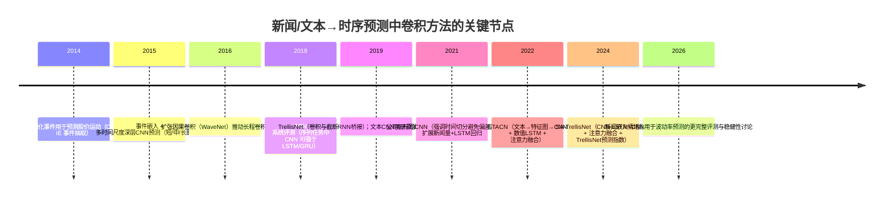

# 卷积特征抽取在新闻文本驱动的时间序列预测中的应用综述

## 执行摘要

过去十余年里，“用新闻/文本来预测数值时间序列（价格、收益率、波动率、宏观指标、商品价格等）”的研究，确实大量采用了卷积思想来做文本特征抽取，并且逐步形成了三条主线：其一是**对文本序列做 1D 卷积（TextCNN/Conv1D）**以捕捉局部 n‑gram 语义模式，再把得到的文本表示输入到预测头或与数值特征融合；其二是**事件抽取→事件嵌入→用深层 CNN 建模“事件在不同时间尺度上的影响”**，把卷积用于对“事件历史窗口”的多尺度归纳；其三是把卷积推广到**TCN/WaveNet 风格的扩张因果卷积**，在更长的时间依赖上替代或补充 RNN，用于把“新闻或新闻情绪指数”与价格序列进行时序建模与融合。citeturn5view0turn18view2turn15view2turn15view1turn16view0

从近 5–10 年（约 2016–2026）的代表性成果看：  
- 在金融市场方向，卷积常以**“文本 CNN 编码器 +（LSTM/注意力/TCN/TrellisNet）时间建模器 + 融合层”**的形式出现，既有只用标题做次日方向分类（~61–65% 一类的准确率区间在多个工作中反复出现），也有面向波动率的回归/概率预测，且对“新闻时间窗切分、交易日对齐与防前视偏差”越来越强调。citeturn5view1turn19view3turn5view0turn18view2turn21view0  
- 在商品与更广泛的经济预测上，也出现了用 CNN 从在线新闻中抽取隐含模式（并结合主题分组）来预测原油价格的开源/开放获取范例，说明卷积式文本特征抽取并不局限于股票。citeturn28view0  
- 与此同时，Transformer（尤其 BERT/FinBERT）在文本表示上占优趋势明显，但卷积仍有“工程上更轻、延迟更低、对小数据与短文本更稳”的位置，且在“情绪指数生成”或“多尺度时间卷积建模”中经常作为可解释、可控的归纳偏置使用。citeturn14view1turn22view0turn5view4

总体结论很直接：**卷积思想不仅被用过，而且在新闻文本→时间序列预测问题中形成了相当系统的谱系**；不过该方向的主要短板也同样明确——数据与评测不统一、容易出现前视偏差、新闻与价格的因果链条难以验证、以及跨市场/跨时期泛化不稳。citeturn19view0turn18view3turn21view0turn30view0

## 研究范围与分类框架

本报告聚焦的任务可形式化为：给定时间序列目标 \(y_t\)（如收益率/方向、价格、波动率、宏观指标等）及其历史数值特征 \(x_{t-\ell:t}\)，同时给定与时间对齐的文本流 \(T_{t-\ell:t}\)（新闻标题/正文、社媒文本、事件描述等），学习预测 \(y_{t+h}\)。其中“卷积思想用于文本特征抽取”主要落在两处：

第一处是**文本编码**：把每条新闻/每天新闻集合映射为向量（或张量）表示，常见做法是对 token/embedding 序列做 1D 卷积（Conv1D/TextCNN），通过不同卷积核宽度捕捉 n‑gram 语义，再池化得到定长表示。TextCNN 在 NLP 中的经典形式是“预训练词向量之上做卷积+池化+分类”，它提供了一个易实现且可解释的局部特征抽取基线。citeturn15view3turn5view1

第二处是**时间建模**：把“按日聚合后的文本特征/情绪指数/事件嵌入”当作外生变量，与数值序列一起输入到时间模型里。这里卷积常以 TCN/WaveNet 风格出现：通过**因果卷积**保证不泄漏未来信息，通过**扩张卷积**扩大感受野以覆盖更长时间依赖；WaveNet 是扩张因果卷积获得大感受野的标志性工作，而 TCN 系统实证显示在多类序列任务上可与甚至超过 LSTM/GRU 基线，并具备更长“有效记忆”。citeturn15view2turn15view1  
TrellisNet 则进一步把卷积与截断 RNN 的联系形式化，通过“跨深度权重共享+输入注入”等结构把两类思想融合。citeturn16view0

基于上述两处，本报告将相关工作分为四类（后文逐类综述）：
- **A 类：文本 Conv1D/CNN → 直接预测（分类/回归）**  
- **B 类：CNN + RNN/注意力（CNN 提文本局部模式，RNN/注意力建模跨日或跨新闻序列）**  
- **C 类：事件抽取/事件嵌入 + 多时间尺度 CNN（用卷积建模“短/中/长”事件影响）**  
- **D 类：情绪指数/文本特征生成（可用 CNN）+ TCN/TrellisNet/WaveNet 时间卷积预测器（卷积承担长程时间建模）**

## 文献综述与时间线

从“卷积进入文本+预测”的角度看，关键拐点大致如下（强调与本问题直接相关的因果链：文本→特征→时序预测）：

- **早期事件与结构化表示（2014–2015）**：一条重要路线是先从新闻标题中抽取结构化事件，再做预测。Ding 等人在 2014 年提出“结构化事件”用于预测股价运动，指出仅靠词袋等浅层特征难以表示事件的施事/受事结构，并用 Open IE 等技术从大规模新闻中抽取事件。citeturn6view3  
  2015 年进一步提出“事件嵌入 + 深层 CNN”，把卷积用于建模事件在短/中/长不同时间尺度上的影响；其数据来自 entity["organization","Reuters","news agency"] 与 entity["company","Bloomberg","financial data company"] 的金融新闻标题（2006-10 至 2013-11），并以准确率与 MCC 及交易模拟收益评估，报告相对基线约 6% 的提升量级。citeturn5view0turn18view2turn18view3

- **文本 CNN 成为“标题级信号提取器”（2016–2021）**：随着 TextCNN 在 NLP 中普及，越来越多股票预测工作采用“词向量→1D 卷积→池化/全连接→预测”的模式；公司级标题预测研究明确在卷积核宽度上做系统对比（如 tri‑gram/quad‑gram 最优的经验），并强调时间切分以避免同一事件的多源标题同时出现在训练与测试集导致虚高。citeturn5view1turn19view2turn19view0  
  同一时期也出现“更大规模新闻标题输入”的卷积变体（如 N‑CNN），通过横向扩展新闻样本量来缓解单股新闻稀疏，并与 LSTM（技术指标）结合，目标指标转向 RMSE 等回归误差。citeturn5view3

- **CNN+RNN/注意力与多模态融合（2018–2024）**：大量工作形成了“文本 CNN/情绪模块 + 数值序列 RNN/LSTM + 融合与注意力”的范式。典型如 STACN：以 seq2seq 自编码器把每天 25 条新闻标题转为“thought vectors”并重排成特征图，再用 CNN 抽取“日内新闻集合”的空间特征，同时用 LSTM 处理历史数值序列；实验显示仅用新闻的 CNN 很弱，而数值 LSTM 强得多，但融合后显著改善（该文以 MSE 和相关系数等评估，并讨论由于时间相关性弱导致的“新闻-only”性能瓶颈）。citeturn5view2turn20view1  
  此外还有更工程化的 CNN‑BiLSTM‑Attention 体系，把新闻先做情绪打分（不一定端到端），再与价格特征一起进入卷积+双向 LSTM + 注意力预测次日收盘等目标。citeturn14view0

- **时间卷积预测器与“情绪指数→TCN/TrellisNet”路线（2024–2026）**：一条更贴近“卷积做长程时间建模”的路线，是先用 CNN（常与 LSTM 结合）训练情绪分析模型，把海量新闻压缩为日频情绪指数，再用 TrellisNet/TCN 等做股票指数预测，并用注意力做融合权重分配。SA‑TrellisNet 的摘要明确包含这三块：CNN 抽语义特征、LSTM 记长依赖，输出情绪指数；然后情绪注意力机制做融合，最后用 TrellisNet 预测，并在 7 个主要股票指数上与多类 SOTA 方法比较。citeturn5view4turn12search26  
  另一方面，波动率预测方向也出现“词向量 + CNN 直接从新闻预测 RV”的系统研究：Rahimikia 等构建了面向金融语境的词嵌入 FinText（来自 entity["organization","Dow Jones Newswires","news service"] 文本流），并用多卷积核（3/4/5）抽取标题模式，再经全连接输出次日 RV 预测，且给出明确的**新闻时间窗切分（从 9:30 到次日 9:30 美东时间）**与滚动窗口训练策略，强调真实部署下的计算成本与训练频率。citeturn21view2turn21view0  
  最新修订版还进一步讨论“新闻单独预测 vs 与传统 RV 基线组合”的增益与稳健性。citeturn13view1

- **非股票场景的文本 CNN：原油价格预测（2019）**：Li 等在《International Journal of Forecasting》提出从在线新闻媒体中用 CNN 抽取隐含模式，并结合 LDA 主题分组与情绪特征来预测原油价格，论文为开放获取，且明确指出文本特征与金融特征在预测上互补。citeturn28view0

补充说明：宏观预测大量使用“新闻情绪指数→回归/机器学习 nowcasting/forecasting”，但卷积并非主流；例如 entity["organization","European Central Bank","central bank, eu"] 工作为欧元区 GDP nowcasting 构建日频新闻情绪序列并比较线性与非线性模型，核心更偏情绪构造与 nowcasting 评测框架，而不是 CNN 文本编码。citeturn11view1  
另有工作用海量公告文本做可解释的语义路径建模以预测宏观指标，也不以卷积为核心。citeturn17view1  
这类“卷积缺位”的事实本身构成研究空白（见文末“未来方向”）。

下面给出一张简化时间线（只列与本报告卷积谱系最相关节点）：



## 关键论文拆解与对比表

本节先用表格给出约 10 篇“卷积参与文本特征抽取、并用于时间序列预测”的代表作，然后补充逐篇要点（方法、数据、表示、目标函数与指标、结果与可复现性）。

### 代表工作对比表

> 说明：若原文/可访问页面未给出细节，标注为“未说明”。“代码链接”按本报告能确认到的公开仓库填写；无官方代码不等于不可复现，但会显著增加复现实验成本。

| 引用 | 年份 | 领域 | 卷积类型 | 输入特征（文本侧） | 数据集/来源 | 主要基线对比 | 关键结果（摘录/指标） | 代码链接 |
|---|---:|---|---|---|---|---|---|---|
| Ding et al., *Deep Learning for Event‑Driven Stock Prediction* (IJCAI) citeturn5view0turn18view2turn18view3 | 2015 | 股票指数/个股方向预测 | 深层 CNN（对事件历史多尺度卷积+池化） | 新闻标题→事件抽取（Open IE）→事件嵌入（NTN） | entity["organization","Reuters","news agency"] + entity["company","Bloomberg","financial data company"] 标题；并用 entity["company","Yahoo Finance","financial data service"] 取价格；时间 2006-10-02 至 2013-11-21 | 与 Luss & d’Aspremont(2012) 与 Ding(2014) 等对比 | 测试集上报告 Acc/MCC/Profit；EB‑CNN 优于两基线；并给出交易模拟策略与显著性检验 | `https://github.com/vedic-partap/Event-Driven-Stock-Prediction-using-Deep-Learning`（非官方复刻） |
| Ding et al., *Using Structured Events to Predict Stock Price Movement* (EMNLP) citeturn6view3 | 2014 | 股票方向预测 | 未使用 CNN（事件抽取路线的奠基） | 标题→结构化事件特征 | 大规模公共新闻（未在本节展开） | 词袋等浅层特征基线 | 报告 S&P 500 指数约 60% 准确率量级与个股更高（论文摘要） | 未说明 |
| Readshaw & Giani, *Using company‑specific headlines and CNNs…* (NCA) citeturn5view1turn19view0turn19view2turn19view3 | 2021 | 个股次日涨跌分类 | 1D TextCNN（多卷积核宽度对比） | 公司相关标题→词向量（Google News word2vec；静态/可微调） | 标题+市场数据（2007–2016）；强调不得随机划分以免事件泄漏 | 不同 embedding 状态与卷积核宽度对比 | 最佳配置约 61.7% accuracy；tri/quad‑gram 宽度常最优；时间切分避免偏差 | 未说明 |
| Lin et al., *STACN*（Spatial‑temporal attention‑based convolutional network）citeturn5view2turn20view1 | 2022 | 股指回归（收盘价） | 2D CNN（对“新闻特征图”卷积）+ LSTM | 每日 25 条标题→seq2seq 自编码器→thought vectors→特征图；并与数值序列融合 | DJIA 价格（来自 entity["company","Yahoo Finance","financial data service"]）；标题来自 entity["company","Reddit","social media platform"] WorldNews（2008‑08‑08 至 2016‑07‑01） | CNN(only news)、CNN(only stocks)、LSTM(only stocks) 等 | 仅新闻 CNN MSE 极差；融合后 STACN MSE 显著更低（表 3）；作者解释新闻与价格时间相关弱导致 bottleneck | 未说明 |
| Rahimikia, Zohren & Poon, *Realised Volatility Forecasting… via Financial Word Embedding*（工作论文/预印本多次修订）citeturn21view2turn21view0turn13view1 | 2021–2026 | 波动率预测（RV） | 1D TextCNN（多核 3/4/5；可调） | 新闻标题→FinText 词嵌入（特训于 entity["organization","Dow Jones Newswires","news service"]）→CNN→FC 输出 RV | 23 只 NASDAQ 股票；滚动窗口；定义新闻时间窗 9:30→次日 9:30（美东） | HAR 家族等 RV 基线 + 新闻模型组合 | 报告新闻单独与组合的 OOS 改善范围，并给出鲁棒性检查（核大小、聚合天数等） | 未说明 |
| Liu et al., *SA‑TrellisNet*（Expert Systems with Applications）citeturn5view4turn12search26 | 2024 | 多国股票指数预测 | TrellisNet（TCN 变体：跨层权重共享）+ CNN‑LSTM 做情绪 | 海量新闻→CNN‑LSTM 情绪分析→情绪指数；再与股票数据融合 | 7 个主要国际指数（S&P500 等；文中列举） | 与多类 SOTA 对比（摘要） | 摘要称在多个指数上系统评估并具竞争力；细节未在可访问摘要中展开 | TrellisNet 基础实现：`https://github.com/locuslab/trellisnet` |
| Zhang & Cai, *N‑CNN: Improving Stock Price Forecasting Using a Large Volume of News Headline Text*（期刊/出版社页）citeturn5view3 | 2021 | 次日波动/回归（RMSE） | CNN（对“新闻量/扩展后标题输入”建模） | 以“中国股市每只股票每日新闻标题数量/扩展输入”构造特征（页面描述） | 中国交易所新闻标题（页面描述） | LSTM(技术指标) 与 LSTM + N‑CNN 补偿 | 页面称可进一步降低 LSTM 的 RMSE；具体数值未在该页展开 | 未说明 |
| Li, Shang & Wang, *Text‑based crude oil price forecasting…*（International Journal of Forecasting，Open Access）citeturn28view0 | 2019 | 原油价格预测 | CNN（从在线新闻抽取模式） | 在线媒体文本→情绪特征 + CNN 特征；再用 LDA 主题分组 | 在线新闻媒体 + 原油价格（摘要未列具体站点/频率） | “older benchmark models”（摘要） | 摘要：主题‑情绪合成模型优于旧基线；文本与金融特征互补；包含滞后阶与特征选择 | 未说明 |
| Vargas 等, *Deep learning for stock market prediction from financial news articles* citeturn13view0 | 2017 | 指数日内方向 | CNN / RNN / RCNN（作者称 RCNN） | 金融新闻标题 + 技术指标；词/事件嵌入（文中概述） | S&P500（文中概述） | CNN vs RNN 等对比（论文摘要） | 摘要：CNN 更擅长捕语义，RNN 更擅长上下文/时间特性；有一定改进 | 未说明 |
| Lee & Soo, *Predict Stock Price with Financial News Based on Recurrent Convolutional Neural Networks*（TAAI）citeturn25view1 | 2017/2018 | 个股价格预测 | “Recurrent Convolutional Neural Networks (RCN)”（卷积+序列建模） | 词向量+新闻信息抽取；并与技术指标结合 | 未说明（摘要页未给） | 技术分析 alone vs 技术分析+RCN；并与 LSTM 对比 | 摘要：融合后优于仅技术分析；RCN 预测误差低于 LSTM | 未说明 |

### 逐篇方法要点与可复现性信息

Ding et al. (2015) 的贡献点非常“卷积化”：它并不是简单把卷积用在文本 token 上，而是把文本先抽为结构化事件并做密集嵌入，然后用深层 CNN 来学习“不同时间尺度事件对价格运动的影响”，并给出数据集切分统计与时间区间（训练/开发/测试）以及 Acc、MCC 与交易模拟收益等多维度评估。citeturn18view2turn18view3  
这里的卷积更接近“对时间窗口内事件序列的模式抽取”，在概念上与后来的 TCN/WaveNet 对长依赖的处理是一致的：通过堆叠卷积层与池化获得更大感受野并压缩成判别性特征。citeturn5view0turn15view2

Readshaw & Giani (2021) 更接近“纯 TextCNN”：把标题表示为词向量矩阵，在卷积层通过不同宽度滤波器捕捉关键短语（作者明确举例 tri/quad‑gram 的情绪短语），并比较静态词向量与可微调词向量配置；同时，他们非常明确地指出本领域常见评估陷阱——不能随机切分训练/测试，否则同一事件的不同来源标题可能同时出现，造成“无意的数据泄漏”。citeturn19view2turn19view0turn19view3

STACN (2022) 是一个“文本→特征图→CNN” 的非典型实现：用 seq2seq 自编码器把每条标题转成 thought vectors，再把一天内的标题向量组织成地图结构喂给 CNN，借助注意力生成空间‑时间权重，并与 LSTM 数值分支融合。实验结果极具启发：仅用新闻标题的 CNN 回归几乎失效，而仅用历史数值的 LSTM 显著更强；最终融合模型最好，作者将其归因于“新闻‑价格的弱时间相关与噪声”，这实际上揭示了新闻驱动预测的核心困难：文本信号通常需要与价格历史、市场状态共同解释。citeturn20view1turn5view2

Rahimikia 等（2021–2026）在“文本 CNN→预测波动率”上提供了难得的工程级细节：明确给出 CNN 结构（示例中并行使用 3/4/5 卷积核），并给出对“无新闻日”的处理、滚动窗口与预测值过滤策略（insanity filter），更关键的是给出与交易日边界一致的新闻聚合时间窗（9:30→次日 9:30 美东），这对避免前视偏差和实现可部署系统非常重要。citeturn21view0turn21view2

SA‑TrellisNet (2024) 把卷积从“文本局部模式”延伸到“时间建模器本身”：先训练 CNN‑LSTM 情绪分析模型把海量新闻压缩为情绪指数，再用情绪注意力机制做融合权重分配，最后把融合序列输入 TrellisNet 做指数预测，并在多个国际指数上系统评估。尽管可访问内容主要是摘要，但其结构反映了一个正在扩散的工程路线：**文本端复杂、预测端要快**，因此把文本压缩为较低频率的指数，再用高效的时间卷积网络预测。citeturn5view4turn16view0

原油价格预测（Li et al., 2019）在更广泛的时间序列预测社区很重要，因为它公开指出两点：CNN 抽取的文本特征与情绪特征对价格变化“有显著关系”，但要进一步提升预测准确率需要按主题分组（LDA），并结合滞后阶与特征选择以构造最优输入组合；同时强调文本特征与金融特征互补。citeturn28view0  
这对金融市场研究也有直接启示：不做主题/语境分离，CNN 学到的往往是“混杂的新闻噪声”。

## 与 RNN、Transformer 及混合模型的比较

卷积、RNN 与 Transformer 在该问题上的差异，本质上来自三种不同的归纳偏置：局部模式（卷积）、顺序状态机（RNN）、全局依赖（自注意力）。在新闻→预测任务里，这三者的优劣通常由数据量、文本长度、预测频率与延迟要求共同决定。

卷积（TextCNN/TCN/WaveNet 风格）的典型优势是：  
- **对短文本的局部关键短语敏感**：TextCNN 的基本观点是卷积核可作为可训练的 n‑gram 探测器，与池化一起得到对位置相对不敏感的判别性特征。citeturn15view3turn19view2  
- **并行计算友好、推理延迟低**：与逐步递归的 RNN 相比，卷积可更充分利用并行；TCN 的系统评测指出在多类序列任务上，简单 TCN 结构可在性能上超过 LSTM/GRU 且具有更长有效记忆。citeturn15view1  
- **长程依赖通过扩张卷积获得**：WaveNet 用扩张因果卷积在不违反时间因果的前提下显著扩大感受野，是“卷积做长序列”路线的代表。citeturn15view2  
- **可解释性相对更直接**：卷积核宽度与“抓取几词短语/几天窗口”的对应关系较直观，Readshaw 的核宽度实验与 Rahimikia 的核大小鲁棒性检查都体现了这一点。citeturn19view3turn21view1

RNN/LSTM 的典型优势是：  
- **顺序累积与门控记忆**更自然，特别是当你把“每天多条新闻”视作一个序列、或把“跨多日新闻影响”视作连续过程时，RNN 往往更贴合问题结构。STACN 的消融显示：在纯数值序列回归上，LSTM 明显强于 CNN；并且在融合架构里，LSTM 分支贡献很大。citeturn20view1  
- 当文本特征已经被压缩为序列（例如情绪指数），RNN 是一个成熟、易调参的基线。许多论文在这一层把 CNN 放在前端特征抽取，RNN 放在后端时间建模。citeturn14view0turn25view1

Transformer/BERT（以及 entity["organization","Google","technology company"] 的 BERT、金融域 FinBERT 等）的典型优势是：  
- **上下文相关表示**对金融语境尤其关键：同一词在财经语境与日常语境含义差异巨大，Rahimikia 提出训练领域词嵌入 FinText 也是为了缓解该问题，只是他们走的是“领域词嵌入 + CNN”的可控路线。citeturn21view2turn21view0  
- 在多模态预测中，BERT 分支常被用来做端到端的文本理解与情绪建模，再与 LSTM 数值分支融合。例如 2024 年的深度融合模型采用 FinBERT 分支处理新闻标题、LSTM 分支处理价格与技术指标，并在多只股票上比较准确率与交易模拟表现。citeturn14view1  
- 在“仅用标题预测短期运动”的设定里，BERT 上下文化嵌入 + RNN 的方法被提出并声称达到 SOTA，并在大量新闻标题上做交易模拟。citeturn24academia41

关键现实是：Transformer 很强，但它并不会让卷积消失。更常见的走向是**混合**：  
- **卷积负责低延迟的局部模式提取或情绪指数生成**，Transformer 负责更深的语义理解（尤其是长文本或多句），时间端用 TCN/TrellisNet 或 LSTM 做状态建模，融合层用注意力或门控。SA‑TrellisNet 的摘要基本就是这一思想的工业化模板。citeturn5view4turn16view0

## 工程与评测要点：对齐、延迟、融合与防止前视偏差

这一类研究“最容易翻车”的不是模型，而是数据流水线与评测协议。以下要点直接来自文献中反复出现的工程事实（并补充可操作建议）。

新闻与价格的时间对齐与窗口定义决定了你是在做预测还是在做“回放解释”。Ding(2015) 明确使用新闻标题做事件抽取，并给出训练/开发/测试时间区间，属于典型的时间切分。citeturn18view2  
更严格的做法是将新闻聚合窗口贴合交易制度：Rahimikia 等把“日 \(t\) 的新闻窗口”定义为 9:30（开盘）到次日 9:30，这样在预测 \(t+1\) 的日内波动率时，输入不会包含 \(t+1\) 开盘后的信息。citeturn21view0  
在数据源包含周末/节假日文本时，还需要显式处理非交易日：例如 CNN‑BiLSTM‑AM 的实现描述中指出要移除周末新闻以保证与交易日对齐。citeturn14view0

新闻数据的切分方式必须防止“同一事件多版本标题泄漏”。Readshaw & Giani 直言：随机划分会让不同来源描述同一事件的标题同时出现在训练与测试集，造成不希望的偏差，因此测试集应由“半小时粒度的唯一标题”构成等。citeturn19view0  
这条原则对几乎所有新闻数据都成立：只要数据源聚合了多家媒体转载，你就要认真做去重、事件聚类或至少按时间块剖分。

在输入表示上，卷积路线大致有三层复杂度（由低到高）：
- **标题→词向量→Conv1D**：Readshaw & Giani 比较静态/可微调词向量，并系统搜索卷积核宽度。citeturn19view2turn19view3  
- **标题→情绪得分/情绪指数→（与数值一起）进入时间模型**：CNN‑BiLSTM‑AM、SA‑TrellisNet 都属于此类，优点是时间端输入维度小、推理快；缺点是文本信息被强压缩，容易丢失语境。citeturn14view0turn5view4  
- **标题集合→更丰富的结构（事件/特征图/主题分组）→CNN**：Ding 的事件抽取与 Li(2019) 的主题分组都说明“先结构化/分组再卷积”能缓解噪声与稀疏。citeturn5view0turn28view0

融合策略通常分为早融合与晚融合：
- **早融合**：把文本表示与数值特征在时间维度上拼接后喂给同一个时序模型（TCN/LSTM）。SA‑TrellisNet 的摘要更像“先得情绪指数，再与股票数据融合进入 TrellisNet”，属于早融合的一种（文本被预聚合）。citeturn5view4turn16view0  
- **晚融合**：文本分支与数值分支各自建模，再在表示层或决策层融合。STACN 明确包含 CNN（文本）与 LSTM（数值）分支，并通过注意力权重生成融合输出。citeturn20view1

实时推理与延迟是一条经常被忽略但对“新闻驱动预测”决定性的约束。Rahimikia 等指出每天训练很昂贵，因此每 5 天训练一次并在接下来几天沿用模型，是一种明确面向部署的权衡。citeturn21view0  
如果你的目标是分钟级/小时级预测，卷积式文本编码器（或情绪指数生成器）在计算与吞吐上通常比大模型更现实；而如果预测频率是日级，Transformer 的高算力成本可能更可接受。

评估协议上，建议至少同时报告三类指标：
- **统计预测误差**：分类用 Accuracy、F1、MCC 等（Ding 使用 Acc/MCC；Readshaw 使用 Accuracy/F1）；回归用 RMSE/MSE 等（N‑CNN 页面强调 RMSE；STACN 用 MSE）。citeturn18view3turn19view3turn5view3turn20view1  
- **金融/业务指标**：交易模拟收益或风险调整收益。Ding 提供了交易模拟策略并做随机化检验，属于相对严谨的金融评估示例。citeturn18view3  
- **稳健性与防偏差检查**：不同新闻聚合天数、不同卷积核大小、不同训练窗口滚动方式、以及严格的时间切分/去重。Rahimikia 明确给出对核大小与新闻聚合的鲁棒性组。citeturn21view1turn21view0

## 可复现实验设计、最小基线与未来方向

### 可用数据集与基准资源

严格意义上，“新闻+时间序列”数据很多是商业数据（entity["organization","Reuters","news agency"]、entity["company","Bloomberg","financial data company"]、entity["organization","Dow Jones Newswires","news service"]），这也是该领域难以统一基准的重要原因之一。citeturn18view2turn21view2turn19view0  
在公开可复现方面，至少有以下可用起点：

- **StockNet 数据集**：虽然文本源是 entity["company","Twitter","social media platform"] 而非传统新闻，但它提供了较规范的“文本+价格”结构、清晰的数据格式与公开代码，是做流水线与评测协议的优质基线资源。其 README 给出：2014-01-01 至 2016-01-01 的两年价格运动，88 只股票，包含 tweet 与价格两部分，并提供对应代码仓库。citeturn30view0turn30view1turn6view2  
- **DJIA+Reddit 标题数据**：STACN 以及若干工作使用“每天 25 条标题 + DJIA 历史数据”的设定，并给出样本量与切分方式（如 1980 样本、1200 训练、780 测试）。citeturn20view1  
- **宏观 nowcasting 的新闻情绪序列**：entity["organization","European Central Bank","central bank, eu"] 工作为欧元区 GDP nowcasting 构建日频新闻情绪序列并与多类模型比较，适合作为“文本→数值指标→nowcasting”评测框架参考（即便你最终用 CNN/TCN，也应借鉴其 nowcasting 切分逻辑）。citeturn11view1  
- **开放获取的原油文本预测**：Li(2019) 提供了“在线新闻文本 + CNN + 主题分组 + 滞后/特征选择”的公开论文入口，适合作为“非股票”文本卷积预测的对照基准。citeturn28view0

部分代码/实现资源（便于搭基线；以下为原样链接，放在代码块内便于复制）：

```text
# 序列卷积（TCN / TrellisNet）参考实现
https://github.com/locuslab/TCN
https://github.com/locuslab/trellisnet

# StockNet 数据与代码
https://github.com/yumoxu/stocknet-dataset
https://github.com/yumoxu/stocknet-code

# TextCNN 复现（用于标题级 CNN 编码器 baseline）
https://github.com/jojonki/cnn-for-sentence-classification

# 事件驱动 CNN 的非官方复刻示例（用于快速搭建对照，不代表官方）
https://github.com/vedic-partap/Event-Driven-Stock-Prediction-using-Deep-Learning
```

### 推荐的可复现实验设计

为了让实验“经得起推敲”，建议用**滚动窗口（rolling/expanding window）+ 严格时间因果输入**作为默认协议，并把“新闻对齐窗口”写入配置文件（可复查）。

一个可落地、且能覆盖卷积谱系的实验矩阵可以这样设计：

- **数据切分**：按时间顺序划分 train/valid/test；再在 test 上做 rolling evaluation（例如每 20 个交易日向前滚动一次训练窗口）。参考 Ding 的明确时间段切分与 Rahimikia 的滚动窗口思想。citeturn18view2turn21view0  
- **文本预处理**：分词/子词；去重（同一事件多源标题）；对每个交易日构造新闻集合。Readshaw 的“不可随机切分”提醒，本质就是要求你在预处理阶段做去重与时间块隔离。citeturn19view0  
- **对齐规则**：明确“新闻窗口结束时刻 ≤ 预测时刻”。可直接采用 Rahimikia 那种明确的 9:30→次日 9:30 框架，或在日级场景下用“收盘后新闻预测次日”之类规则，但必须写死并可复查。citeturn21view0  
- **模型族对照**（最少四个）：  
  - 仅数值：LSTM / TCN（作为下限/对照）。STACN 中数值 LSTM 强于新闻 CNN 的现象说明必须有该基线，否则很难解释文本贡献。citeturn20view1  
  - 文本 CNN：TextCNN（多核宽度 3/4/5）→ pooling → MLP/线性头。citeturn15view3turn19view3  
  - CNN+RNN：TextCNN 编码每日新闻→拼接到数值序列→LSTM/GRU；或文本 CNN 分支+数值 LSTM 分支晚融合（类似 STACN 的思路但简化）。citeturn20view1turn14view0  
  - CNN/情绪指数 + TCN/TrellisNet：先训练轻量 CNN 情绪模型得到日情绪指数，再与数值序列输入 TCN/TrellisNet（与 SA‑TrellisNet 的摘要结构一致）。citeturn5view4turn16view0  
- **损失与指标**：  
  - 分类：交叉熵 + MCC/Accuracy/F1；可附交易模拟。Ding 给出 Acc/MCC 与交易模拟利润，是较完整的组合。citeturn18view3  
  - 回归：MSE/RMSE；可附相关系数；STACN 使用 MSE 作为主指标。citeturn20view1

### 最小基线实现轮廓

下面给出一个“可复现实验最小闭环”的实现结构（强调数据流水线与评测，而非追求 SOTA）：

```mermaid
flowchart TD
    A[原始数据源: 新闻/标题流 + 价格序列] --> B[时间戳标准化/时区统一]
    B --> C[交易日历对齐: 过滤非交易日/处理周末]
    C --> D[新闻聚合窗口定义: 例如 t日9:30→t+1日9:30]
    D --> E[文本预处理: 去重/分词/截断与padding]
    E --> F[文本表示: 词向量/子词嵌入]
    F --> G[TextCNN/Conv1D 编码器: 多核宽度 + 池化]
    C --> H[数值特征: OHLCV/技术指标/滞后特征]
    G --> I[融合: concat / attention / gating]
    H --> I
    I --> J[预测头: 分类(方向)或回归(价格/波动率)]
    J --> K[评估: 时间滚动OOS + 统计指标 + (可选)交易模拟]
    K --> L[防偏差检查: 前视/泄漏/重复事件/超参选择]
```

最小模型建议从“TextCNN 日表示 + 数值 TCN + 早融合”开始：  
- **文本 CNN**：核宽 \(\{3,4,5\}\)，每种核若干 filters，max‑pool 得到日向量（对应 Rahimikia 的并行 3/4/5 核结构与 Readshaw 的核宽搜索直觉）。citeturn21view0turn19view3  
- **数值 TCN**：因果扩张卷积 + 残差（参考 TCN 论文的通用结构与开源实现）。citeturn15view1turn29view2  
- **融合**：把文本日向量在时间维复制/对齐后与数值特征拼接，输入预测头；或直接作为外生变量输入到每个时间步的 TCN block。  
- **训练**：rolling window；验证集只用于早停与超参选择，严禁用测试集调参（Ding/Readshaw 反复提示的泄漏问题，本质上就是这条纪律）。citeturn18view2turn19view0

一个简化的“架构示意图”（文本 CNN + 数值 TCN + 融合）如下：

```mermaid
flowchart LR
    subgraph TextBranch[文本分支]
        T[日内新闻标题序列] --> Tok[Token/Embedding]
        Tok --> CNN[Conv1D 多核(3/4/5)+ReLU]
        CNN --> Pool[MaxPool]
        Pool --> zt[文本日向量 z_t]
    end

    subgraph NumBranch[数值分支]
        X[数值序列 x_{t-L:t}] --> TCN[TCN: 因果扩张卷积+残差]
        TCN --> ht[数值表示 h_t]
    end

    zt --> Fuse[融合: concat / attention / gating]
    ht --> Fuse
    Fuse --> Head[预测头: 分类或回归]
    Head --> y[输出 y_{t+h}]
```

### 研究空白、局限与值得投入的方向

局限最主要的不是“卷积能不能用”，而是“信号、评测与泛化”：

- **缺乏统一基准与可比评测**：Readshaw 明确指出该领域缺少大多数工作共同使用的标准数据集，导致结果难以公平比较。citeturn19view0  
- **前视偏差与事件泄漏极易发生**：从 Ding 的交易模拟到 Readshaw 的切分策略，再到 Rahimikia 的交易日窗口定义，本领域一再强调“时间因果”，这实际上说明很多公开结果在严格协议下会掉不少。citeturn18view3turn19view0turn21view0  
- **新闻信号噪声大且与价格关系弱**：STACN 的消融（仅新闻 CNN 极差）与 Li(2019) 强调的主题分组，都说明不做语境分离/主题过滤，卷积学到的多是噪声。citeturn20view1turn28view0  
- **数据版权与不可复现**：核心数据源 часто为商业新闻流（Reuters/Bloomberg/Dow Jones Newswires），这直接限制了可复现研究规模。citeturn18view2turn21view2

在此基础上，比较“有希望、且卷积仍能发挥作用”的方向包括：

- **“主题感知”的卷积文本编码**：沿 Li(2019) 的路线，把 CNN 抽取的文本模式按主题/事件类型分组，再把主题‑时间序列输入到 TCN/TrellisNet；这有望提升稳定性并降低噪声。citeturn28view0turn5view4  
- **多频率与延迟建模**：把新闻流（分钟级）压缩成可解释的多尺度指数（例如分行业/分主题情绪），再与日频/小时频价格模型融合；SA‑TrellisNet 的“情绪注意力融合”是一个雏形。citeturn5view4turn16view0  
- **卷积与 Transformer 的分工协作**：Transformer 擅长语境理解，卷积擅长低延迟局部模式与长序列时间建模（TCN/WaveNet）。在资源受限或需要实时的系统中，卷积仍可能是“可部署 SOTA”的关键组件。citeturn15view2turn15view1turn14view1  
- **更严格的“可交易”评估**：继续沿 Ding 的方向，把统计指标与交易模拟结合，并把交易成本、滑点、可交易性约束纳入标准评测（否则容易出现“准确率提升但不可交易”的结果）。citeturn18view3turn19view3  
- **跨市场与跨时期泛化**：StockNet 的开源数据说明“跨股票横截面评测”是可做的；但要把它扩展到新闻驱动预测，需要更多开放新闻语料与一致的对齐协议。citeturn30view0turn6view2